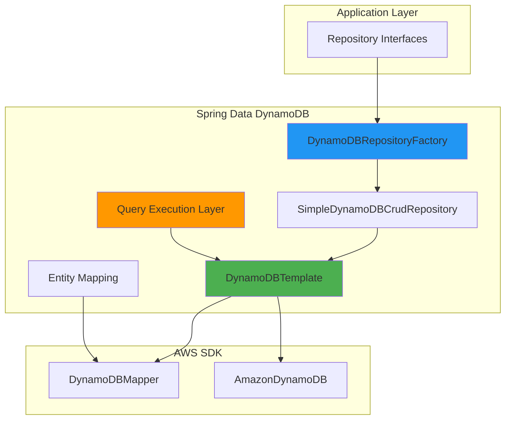
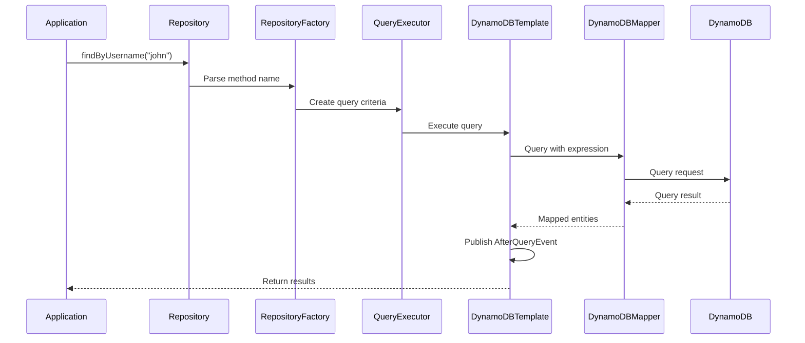
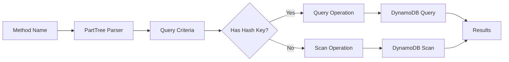
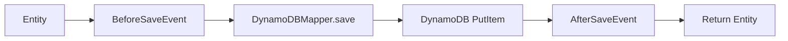

# Architecture Overview

This section provides an in-depth technical overview of Spring Data DynamoDB's internal architecture, design patterns,
and implementation details.

## Introduction

Spring Data DynamoDB follows the Spring Data programming model to provide a familiar and consistent abstraction over AWS
DynamoDB. The library bridges the gap between Spring Data's repository pattern and AWS SDK's DynamoDB client, while
adding powerful features like query method parsing, event publishing, and scan protection.

## Architecture Layers

## Core Components

The architecture is built around several key components:

### 1. DynamoDBTemplate

The central class for all DynamoDB operations. Acts as the bridge between Spring Data abstractions and AWS SDK's
DynamoDBMapper.

### 2. Repository Layer

Factory and repository implementations that provide CRUD operations and query method execution.

### 3. Query Execution Engine

Parses repository method names into DynamoDB query/scan operations with multiple execution strategies.

### 4. Entity Mapping

Metadata extraction and key management for DynamoDB entities with support for hash and range keys.

### 5. Event Publishing

Lifecycle event system for pre/post operation hooks (save, delete, load, query, scan).

## Request Flow

## Key Design Principles

### 1. Separation of Concerns

- **Operations Layer**: DynamoDBOperations interface defines contract
- **Template Pattern**: DynamoDBTemplate implements operations
- **Repository Layer**: Handles CRUD and custom queries
- **Query Layer**: Method name parsing and execution

### 2. Strategy Pattern

Multiple execution strategies based on return type:

- CollectionExecution - Returns List
- PagedExecution - Returns Page with count
- SlicedExecution - Returns Slice without count
- SingleEntityExecution - Returns single entity
- DeleteExecution - Batch delete operations

### 3. Factory Pattern

Repository instances are created dynamically based on:

- Entity metadata (hash key vs hash+range key)
- Repository interface type
- Custom implementation presence

### 4. Event-Driven Architecture

Lifecycle events published for:

- BeforeSave / AfterSave
- BeforeDelete / AfterDelete
- AfterLoad
- AfterQuery / AfterScan

## Components by Responsibility

| Component                     | Package            | Responsibility                       |
|-------------------------------|--------------------|--------------------------------------|
| DynamoDBTemplate              | core               | Core operations and event publishing |
| DynamoDBOperations            | core               | Operations contract                  |
| SimpleDynamoDBCrudRepository  | repository.support | CRUD implementation                  |
| DynamoDBRepositoryFactory     | repository.support | Repository instance creation         |
| PartTreeDynamoDBQuery         | repository.query   | Method name parsing                  |
| AbstractDynamoDBQuery         | repository.query   | Query execution strategies           |
| DynamoDBQueryCreator          | repository.query   | Query criteria builder               |
| DynamoDBEntityMetadataSupport | repository.support | Entity metadata extraction           |
| HashKeyExtractor              | repository.support | Key extraction strategies            |

## Data Flow Patterns

### Query Operations

### Save Operations

## Navigation

Explore detailed documentation for each component:

1. [Core Components](core-components.html) - DynamoDBTemplate, DynamoDBOperations, and AWS SDK integration
2. [Repository Layer](repository-layer.html) - Repository factory, CRUD operations, and scan permissions
3. [Query Execution](query-execution.html) - Query parsing, execution strategies, and method name resolution
4. [Entity Mapping](entity-mapping.html) - Metadata extraction, key management, and annotations
5. [Design Patterns](design-patterns.html) - Scan protection, batch operations, event publishing, and lazy loading

## Architecture Characteristics

| Characteristic    | Description                                               |
|-------------------|-----------------------------------------------------------|
| **Modularity**    | Clear separation between layers and components            |
| **Extensibility** | Easy to add custom repository methods and event listeners |
| **Type Safety**   | Strongly typed repository interfaces and entity mapping   |
| **Performance**   | Efficient query/scan operations with lazy loading support |
| **Safety**        | Scan protection prevents accidental expensive operations  |
| **Consistency**   | Follows Spring Data programming model conventions         |

## Integration Points

### Spring Framework

- ApplicationContext integration for event publishing
- Dependency injection for all components
- Configuration via `@EnableDynamoDBRepositories`

### AWS SDK

- Direct use of DynamoDBMapper for entity mapping
- AmazonDynamoDB client for low-level operations
- DynamoDBMapperConfig for customization

### Spring Data

- Extends Spring Data repository interfaces
- Uses Spring Data query method parsing
- Compatible with Spring Data pagination and sorting

## Next Steps

For implementation details and code examples, explore the component-specific documentation pages listed above.
