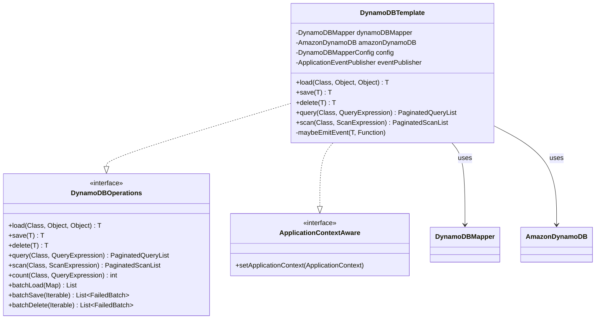
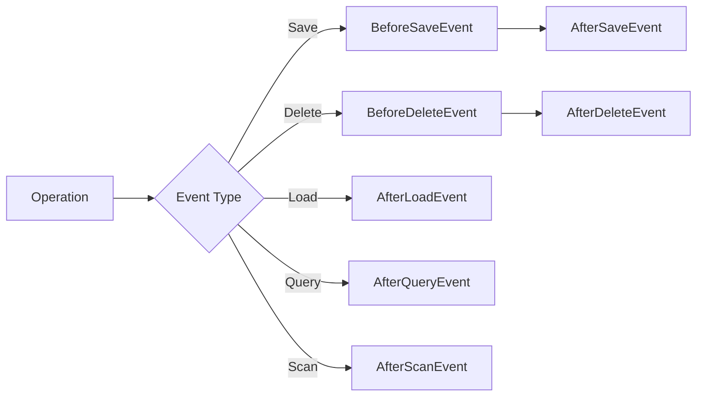
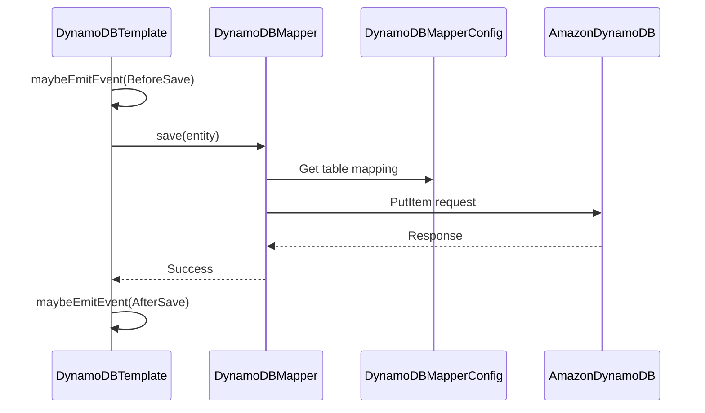

# Core Components

The core components form the foundation of Spring Data DynamoDB, providing the essential infrastructure for DynamoDB
operations and Spring integration.

## Component Overview



## DynamoDBOperations Interface

The `DynamoDBOperations` interface defines the contract for all DynamoDB data access operations. It serves as the
abstraction layer between Spring Data repositories and the AWS SDK.

### Interface Definition

```java
public interface DynamoDBOperations {
    // Single item operations
    <T> T load(Class<T> domainClass, Object hashKey, Object rangeKey);
    <T> T load(Class<T> domainClass, Object hashKey);
    <T> T save(T entity);
    <T> T delete(T entity);

    // Query operations
    <T> PaginatedQueryList<T> query(Class<T> clazz, DynamoDBQueryExpression<T> expression);
    <T> PaginatedQueryList<T> query(Class<T> clazz, QueryRequest queryRequest);
    <T> int count(Class<T> clazz, DynamoDBQueryExpression<T> expression);
    <T> int count(Class<T> clazz, QueryRequest queryRequest);

    // Scan operations
    <T> PaginatedScanList<T> scan(Class<T> clazz, DynamoDBScanExpression expression);
    <T> int count(Class<T> clazz, DynamoDBScanExpression expression);

    // Batch operations
    <T> List<T> batchLoad(Map<Class<?>, List<KeyPair>> itemsToGet);
    List<FailedBatch> batchSave(Iterable<?> entities);
    List<FailedBatch> batchDelete(Iterable<?> entities);

    // Metadata operations
    <T> String getOverriddenTableName(Class<T> domainClass, String tableName);
    <T> DynamoDBMapperTableModel<T> getTableModel(Class<T> domainClass);
}
```

### Design Rationale

**Why an interface?**

- Enables testing with mock implementations
- Allows custom implementations if needed
- Follows Spring's template pattern conventions
- Provides clear contract for repository layer

## DynamoDBTemplate

`DynamoDBTemplate` is the central class for DynamoDB operations, similar to `JdbcTemplate` in Spring JDBC. It wraps AWS
SDK components and adds Spring Data features.

### Key Responsibilities

1. **Operation Execution** - Delegates to DynamoDBMapper
2. **Event Publishing** - Publishes lifecycle events for operations
3. **Configuration Management** - Handles DynamoDBMapperConfig
4. **Table Name Resolution** - Applies table name overrides

### Implementation Details

```java
public class DynamoDBTemplate implements DynamoDBOperations, ApplicationContextAware {
    private final DynamoDBMapper dynamoDBMapper;
    private final AmazonDynamoDB amazonDynamoDB;
    private final DynamoDBMapperConfig dynamoDBMapperConfig;
    private ApplicationEventPublisher eventPublisher;

    @Autowired
    public DynamoDBTemplate(AmazonDynamoDB amazonDynamoDB,
                           DynamoDBMapper dynamoDBMapper,
                           DynamoDBMapperConfig dynamoDBMapperConfig) {
        Assert.notNull(amazonDynamoDB, "amazonDynamoDB must not be null!");
        Assert.notNull(dynamoDBMapper, "dynamoDBMapper must not be null!");
        Assert.notNull(dynamoDBMapperConfig, "dynamoDBMapperConfig must not be null!");

        this.amazonDynamoDB = amazonDynamoDB;
        this.dynamoDBMapper = dynamoDBMapper;
        this.dynamoDBMapperConfig = dynamoDBMapperConfig;
    }

    @Override
    public void setApplicationContext(ApplicationContext applicationContext) {
        this.eventPublisher = applicationContext;
    }
}
```

### Load Operations

Supports both hash-only and hash+range key entities:

```java
@Override
public <T> T load(Class<T> domainClass, Object hashKey, Object rangeKey) {
    T entity = dynamoDBMapper.load(domainClass, hashKey, rangeKey);
    maybeEmitEvent(entity, AfterLoadEvent::new);
    return entity;
}

@Override
public <T> T load(Class<T> domainClass, Object hashKey) {
    T entity = dynamoDBMapper.load(domainClass, hashKey);
    maybeEmitEvent(entity, AfterLoadEvent::new);
    return entity;
}
```

**Key Features:**

- Automatic event publishing after load
- Null-safe event handling
- Support for composite keys

### Save Operations

```java
@Override
public <T> T save(T entity) {
    maybeEmitEvent(entity, BeforeSaveEvent::new);
    dynamoDBMapper.save(entity);
    maybeEmitEvent(entity, AfterSaveEvent::new);
    return entity;
}

@Override
public List<FailedBatch> batchSave(Iterable<?> entities) {
    entities.forEach(it -> maybeEmitEvent(it, BeforeSaveEvent::new));
    List<FailedBatch> result = dynamoDBMapper.batchSave(entities);
    entities.forEach(it -> maybeEmitEvent(it, AfterSaveEvent::new));
    return result;
}
```

**Design Decisions:**

- Events published even for batch operations
- Returns failed batches for error handling
- BeforeSave events allow modification/validation
- AfterSave events for auditing/caching

### Query Operations

Two variants of query operations are supported:

#### High-Level Query (DynamoDBQueryExpression)

```java
@Override
public <T> PaginatedQueryList<T> query(Class<T> domainClass,
                                       DynamoDBQueryExpression<T> queryExpression) {
    PaginatedQueryList<T> results = dynamoDBMapper.query(domainClass, queryExpression);
    maybeEmitEvent(results, AfterQueryEvent::new);
    return results;
}
```

#### Low-Level Query (QueryRequest)

```java
@Override
public <T> PaginatedQueryList<T> query(Class<T> clazz, QueryRequest queryRequest) {
    QueryResult queryResult = amazonDynamoDB.query(queryRequest);

    // Deactivate lazy loading if limit is set
    if (queryRequest.getLimit() != null) {
        queryResult.setLastEvaluatedKey(null);
    }

    return new PaginatedQueryList<T>(
        dynamoDBMapper,
        clazz,
        amazonDynamoDB,
        queryRequest,
        queryResult,
        dynamoDBMapperConfig.getPaginationLoadingStrategy(),
        dynamoDBMapperConfig
    );
}
```

**Why Two Variants?**

- High-level for type-safe queries with mapped entities
- Low-level for advanced use cases (projections, custom expressions)
- Low-level allows limit control without pagination

### Count Operations

Efficient counting with pagination handling:

```java
@Override
public <T> int count(Class<T> clazz, QueryRequest mutableQueryRequest) {
    mutableQueryRequest.setSelect(Select.COUNT);

    int count = 0;
    QueryResult queryResult = null;
    do {
        queryResult = amazonDynamoDB.query(mutableQueryRequest);
        count += queryResult.getCount();
        mutableQueryRequest.setExclusiveStartKey(queryResult.getLastEvaluatedKey());
    } while (queryResult.getLastEvaluatedKey() != null);

    return count;
}
```

**Implementation Notes:**

- Uses SELECT=COUNT for efficiency
- Handles pagination automatically
- No items transferred, only count
- Accumulates counts across pages

### Batch Operations

```java
@SuppressWarnings("unchecked")
@Override
public <T> List<T> batchLoad(Map<Class<?>, List<KeyPair>> itemsToGet) {
    return dynamoDBMapper.batchLoad(itemsToGet).values().stream()
        .flatMap(v -> v.stream())
        .map(e -> (T) e)
        .map(entity -> {
            maybeEmitEvent(entity, AfterLoadEvent::new);
            return entity;
        })
        .collect(Collectors.toList());
}
```

**Batch Operation Characteristics:**

- Events published for each entity
- Failed batches returned for retry logic
- Maintains order where possible
- Supports mixed entity types in batchLoad

## Event Publishing System

### Event Publishing Implementation

```java
protected <T> void maybeEmitEvent(@Nullable T source,
                                 Function<T, DynamoDBMappingEvent<T>> factory) {
    if (eventPublisher != null) {
        if (source != null) {
            DynamoDBMappingEvent<T> event = factory.apply(source);
            eventPublisher.publishEvent(event);
        }
    }
}
```

**Design Principles:**

- Null-safe: Only publishes if event publisher is available
- Generic: Works with any event type via factory function
- Non-blocking: Event handling doesn't block operations
- Optional: Works without ApplicationContext

### Available Events



| Event             | When Published            | Use Cases                               |
|-------------------|---------------------------|-----------------------------------------|
| BeforeSaveEvent   | Before save/batchSave     | Validation, computed fields, timestamps |
| AfterSaveEvent    | After save/batchSave      | Auditing, cache updates, notifications  |
| BeforeDeleteEvent | Before delete/batchDelete | Soft deletes, cleanup, authorization    |
| AfterDeleteEvent  | After delete/batchDelete  | Auditing, cache invalidation            |
| AfterLoadEvent    | After load/batchLoad      | Security checks, lazy loading           |
| AfterQueryEvent   | After query operations    | Query metrics, result caching           |
| AfterScanEvent    | After scan operations     | Scan metrics, performance monitoring    |

## AWS SDK Integration

### DynamoDBMapper Integration



### Configuration Management

```java
@Override
public <T> String getOverriddenTableName(Class<T> domainClass, String tableName) {
    if (dynamoDBMapperConfig.getTableNameOverride() != null) {
        if (dynamoDBMapperConfig.getTableNameOverride().getTableName() != null) {
            tableName = dynamoDBMapperConfig.getTableNameOverride().getTableName();
        } else {
            tableName = dynamoDBMapperConfig.getTableNameOverride()
                           .getTableNamePrefix() + tableName;
        }
    } else if (dynamoDBMapperConfig.getTableNameResolver() != null) {
        tableName = dynamoDBMapperConfig.getTableNameResolver()
                       .getTableName(domainClass, dynamoDBMapperConfig);
    }
    return tableName;
}
```

**Configuration Options:**

- **TableNameOverride**: Override specific table name
- **TableNamePrefix**: Add prefix to all table names
- **TableNameResolver**: Custom resolution strategy
- **PaginationLoadingStrategy**: LAZY_LOADING or EAGER_LOADING

## Table Model Access

```java
@Override
public <T> DynamoDBMapperTableModel<T> getTableModel(Class<T> domainClass) {
    return dynamoDBMapper.getTableModel(domainClass, dynamoDBMapperConfig);
}
```

**Table Model Provides:**

- Attribute name mappings
- Hash and range key definitions
- Global/Local secondary index metadata
- Type converters and marshallers

## Usage Example

```java
@Configuration
@EnableDynamoDBRepositories(basePackages = "com.example.repositories")
public class DynamoDBConfig {

    @Bean
    public AmazonDynamoDB amazonDynamoDB() {
        return AmazonDynamoDBClientBuilder.standard()
            .withRegion(Regions.US_EAST_1)
            .build();
    }

    @Bean
    public DynamoDBMapperConfig dynamoDBMapperConfig() {
        return DynamoDBMapperConfig.builder()
            .withTableNameOverride(
                DynamoDBMapperConfig.TableNameOverride.withTableNamePrefix("dev_")
            )
            .withSaveBehavior(DynamoDBMapperConfig.SaveBehavior.UPDATE)
            .build();
    }

    @Bean
    public DynamoDBMapper dynamoDBMapper(AmazonDynamoDB amazonDynamoDB,
                                         DynamoDBMapperConfig config) {
        return new DynamoDBMapper(amazonDynamoDB, config);
    }

    @Bean
    public DynamoDBTemplate dynamoDBTemplate(AmazonDynamoDB amazonDynamoDB,
                                            DynamoDBMapper dynamoDBMapper,
                                            DynamoDBMapperConfig config) {
        return new DynamoDBTemplate(amazonDynamoDB, dynamoDBMapper, config);
    }
}
```

## Testing Considerations

### Mocking DynamoDBOperations

```java
@ExtendWith(MockitoExtension.class)
class RepositoryTest {

    @Mock
    private DynamoDBOperations operations;

    @Test
    void testSave() {
        User user = new User("123", "John");
        when(operations.save(any(User.class))).thenReturn(user);

        User saved = operations.save(user);
        assertThat(saved).isNotNull();
        verify(operations).save(user);
    }
}
```

### Using Test Containers

```java
@SpringBootTest
@Testcontainers
class IntegrationTest {

    @Container
    static DynamoDBContainer dynamoDBContainer =
        new DynamoDBContainer(DockerImageName.parse("amazon/dynamodb-local"));

    @DynamicPropertySource
    static void setProperties(DynamicPropertyRegistry registry) {
        registry.add("amazon.dynamodb.endpoint",
            dynamoDBContainer::getEndpoint);
    }
}
```

## Performance Considerations

### Lazy Loading

PaginatedQueryList and PaginatedScanList support lazy loading:

- Results fetched page-by-page on iteration
- Configurable via DynamoDBMapperConfig
- Memory efficient for large result sets

### Batch Operations

- **BatchSave**: Up to 25 items per batch (AWS limit)
- **BatchDelete**: Up to 25 items per batch (AWS limit)
- **BatchLoad**: Up to 100 items per batch (AWS limit)
- Failed batches returned for retry logic

## Best Practices

1. **Always configure DynamoDBMapperConfig** for environment-specific settings
2. **Use batch operations** for multiple items to reduce API calls
3. **Handle failed batches** in batch operations with retry logic
4. **Subscribe to events** for cross-cutting concerns (auditing, caching)
5. **Use query over scan** whenever possible for better performance
6. **Configure pagination strategy** based on memory constraints

## Next Steps

- [Repository Layer](repository-layer.html) - Learn how repositories use these core components
- [Query Execution](query-execution.html) - Understand query method parsing and execution
- [Entity Mapping](entity-mapping.html) - Explore entity metadata and key extraction
