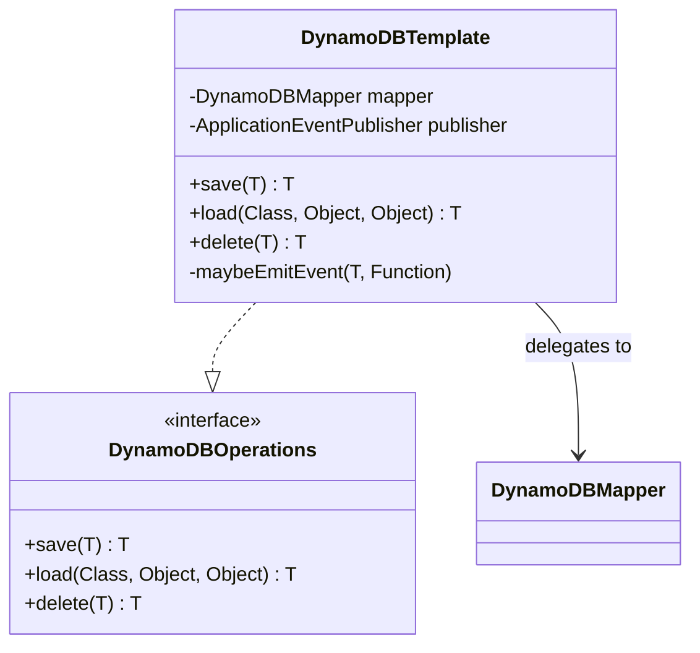
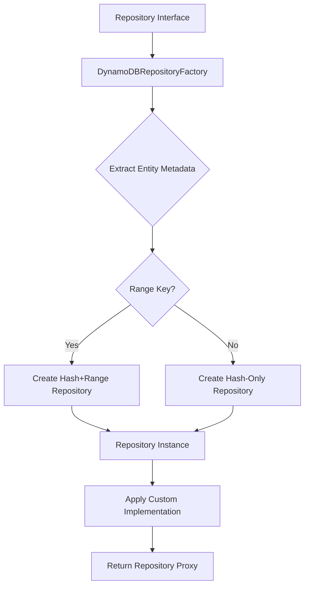
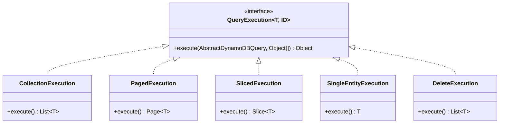
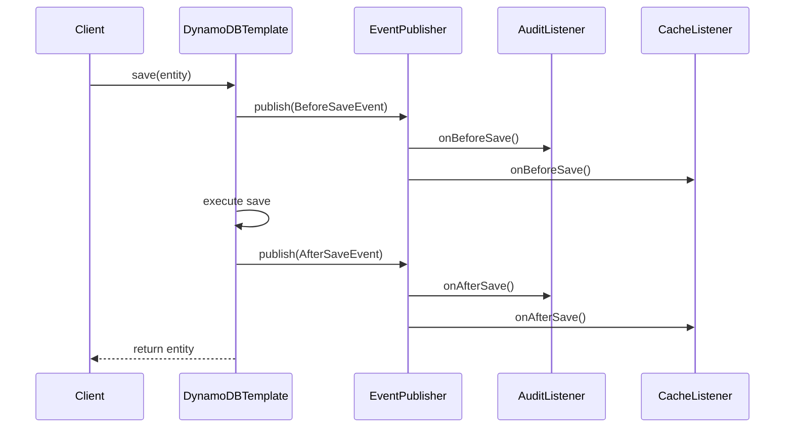
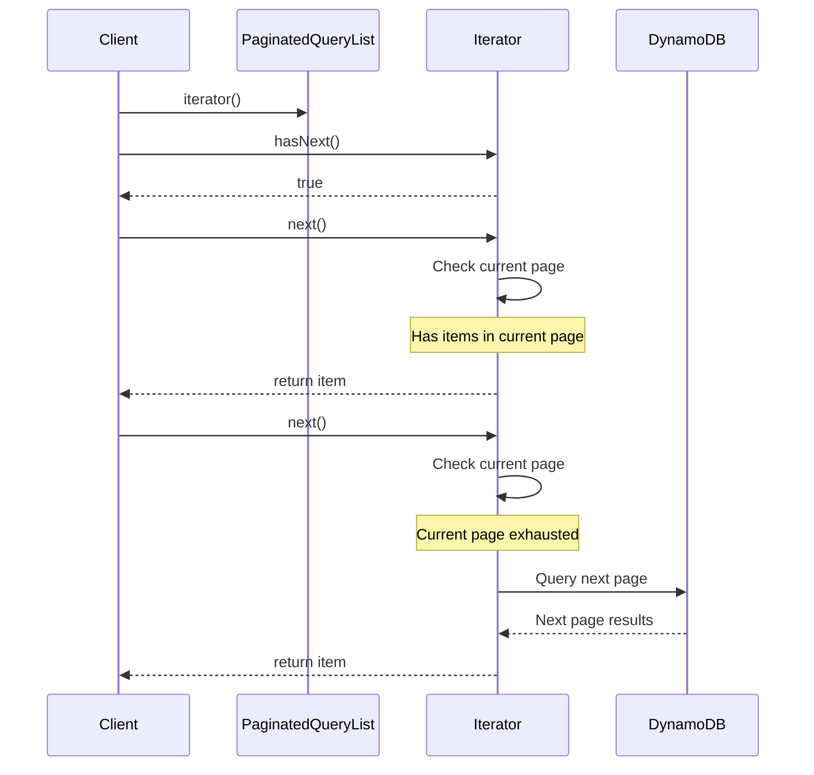
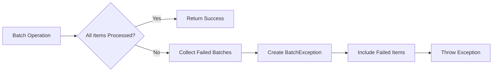
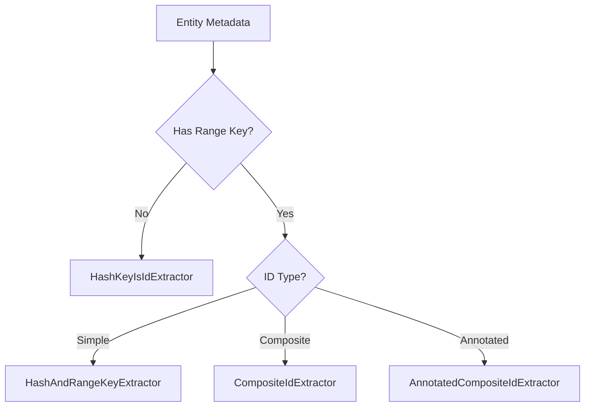

# Design Patterns

Spring Data DynamoDB employs several well-established design patterns and introduces DynamoDB-specific patterns to
provide a robust, efficient, and safe data access layer.

## Table of Contents

{: .no_toc .text-delta }

1. TOC
   {:toc}

## Template Pattern

### Overview

The Template Pattern is the foundation of DynamoDBTemplate, providing a consistent approach to DynamoDB operations while
handling cross-cutting concerns.

### Implementation



### Benefits

**Consistent Error Handling:**

```java
public class DynamoDBTemplate implements DynamoDBOperations {

    @Override
    public <T> T save(T entity) {
        try {
            maybeEmitEvent(entity, BeforeSaveEvent::new);
            dynamoDBMapper.save(entity);
            maybeEmitEvent(entity, AfterSaveEvent::new);
            return entity;
        } catch (AmazonDynamoDBException e) {
            // Consistent exception translation
            throw translateException(e);
        }
    }
}
```

**Cross-Cutting Concerns:**

- Event publishing (auditing, logging)
- Exception translation
- Transaction management (future)
- Metrics collection (future)

**Testability:**

```java
// Mock the interface, not the implementation
@Mock
private DynamoDBOperations operations;

@Test
void testSave() {
    User user = new User("123", "john");
    when(operations.save(any(User.class))).thenReturn(user);

    User saved = operations.save(user);
    assertThat(saved).isNotNull();
}
```

## Factory Pattern

### Repository Factory

Creates repository instances with appropriate configuration based on entity metadata.



### Dynamic Repository Creation

```java
public class DynamoDBRepositoryFactory extends RepositoryFactorySupport {

    @Override
    protected Object getTargetRepository(RepositoryInformation metadata) {
        DynamoDBEntityInformation<?, ?> entityInformation =
            getEntityInformation(metadata.getDomainType());

        if (entityInformation.isRangeKeyAware()) {
            // Factory creates appropriate implementation based on entity structure
            return new SimpleDynamoDBPagingAndSortingRepository(
                entityInformation,
                dynamoDBOperations,
                getEnableScanPermissions(metadata)
            );
        } else {
            return new SimpleDynamoDBCrudRepository(
                entityInformation,
                dynamoDBOperations,
                getEnableScanPermissions(metadata)
            );
        }
    }
}
```

### Benefits

- **Decoupling**: Clients don't know concrete repository classes
- **Flexibility**: Easy to add new repository types
- **Configuration**: Centralized repository configuration
- **Type Safety**: Compile-time type checking

## Strategy Pattern

### Query Execution Strategies

Different execution strategies for different return types.



### Strategy Selection

```java
protected QueryExecution<T, ID> getExecution() {
    if (method.isCollectionQuery() && !isSingleEntityResultsRestriction()) {
        return new CollectionExecution();
    } else if (method.isSliceQuery()) {
        return new SlicedExecution(method.getParameters());
    } else if (method.isPageQuery()) {
        return new PagedExecution(method.getParameters());
    } else if (isDeleteQuery()) {
        return new DeleteExecution();
    } else {
        return new SingleEntityExecution();
    }
}
```

### Example: Paged vs Sliced Execution

```java
// PagedExecution: Executes count query for total
class PagedExecution implements QueryExecution<T, ID> {
    @Override
    public Object execute(AbstractDynamoDBQuery<T, ID> query, Object[] values) {
        List<T> results = query.doCreateQuery(values).getResultList();
        Long count = query.doCreateCountQuery(values, true).getSingleResult();
        return new PageImpl<>(readPage(results), pageable, count);
    }
}

// SlicedExecution: Peeks ahead instead of counting
class SlicedExecution implements QueryExecution<T, ID> {
    @Override
    public Object execute(AbstractDynamoDBQuery<T, ID> query, Object[] values) {
        List<T> results = query.doCreateQuery(values).getResultList();
        List<T> page = readPage(results);
        boolean hasNext = hasMoreResults(results, page.size());
        return new SliceImpl<>(page, pageable, hasNext);
    }
}
```

### Benefits

- **Flexibility**: Easy to add new execution strategies
- **Single Responsibility**: Each strategy handles one return type
- **Optimized**: Different strategies optimized for their use case
- **Maintainability**: Changes to one strategy don't affect others

## Observer Pattern (Event Publishing)

### Event-Driven Architecture



### Event Hierarchy

```java
// Base event
public abstract class DynamoDBMappingEvent<T> extends ApplicationEvent {
    private final T source;

    public DynamoDBMappingEvent(T source) {
        super(source);
        this.source = source;
    }

    public T getSource() {
        return source;
    }
}

// Lifecycle events
public class BeforeSaveEvent<T> extends DynamoDBMappingEvent<T> {
    public BeforeSaveEvent(T source) { super(source); }
}

public class AfterSaveEvent<T> extends DynamoDBMappingEvent<T> {
    public AfterSaveEvent(T source) { super(source); }
}

public class AfterLoadEvent<T> extends DynamoDBMappingEvent<T> {
    public AfterLoadEvent(T source) { super(source); }
}
```

### Event Listener Implementation

```java
@Component
public class AuditingEventListener extends AbstractDynamoDBEventListener<User> {

    @Override
    public void onBeforeSave(BeforeSaveEvent<User> event) {
        User user = event.getSource();
        if (user.getCreatedAt() == null) {
            user.setCreatedAt(new Date());
        }
        user.setModifiedAt(new Date());
    }

    @Override
    public void onAfterSave(AfterSaveEvent<User> event) {
        User user = event.getSource();
        log.info("User saved: id={}, username={}", user.getUserId(), user.getUsername());
    }

    @Override
    public void onAfterLoad(AfterLoadEvent<User> event) {
        User user = event.getSource();
        // Decrypt sensitive data
        user.setEmail(decrypt(user.getEmail()));
    }
}
```

### Common Use Cases

**Auditing:**

```java
@Component
public class AuditListener extends AbstractDynamoDBEventListener<AuditableEntity> {

    @Override
    public void onBeforeSave(BeforeSaveEvent<AuditableEntity> event) {
        AuditableEntity entity = event.getSource();
        String currentUser = SecurityContextHolder.getContext()
            .getAuthentication().getName();

        if (entity.getCreatedBy() == null) {
            entity.setCreatedBy(currentUser);
            entity.setCreatedDate(Instant.now());
        }
        entity.setLastModifiedBy(currentUser);
        entity.setLastModifiedDate(Instant.now());
    }
}
```

**Caching:**

```java
@Component
public class CacheEventListener extends AbstractDynamoDBEventListener<Object> {

    @Autowired
    private CacheManager cacheManager;

    @Override
    public void onAfterSave(AfterSaveEvent<Object> event) {
        // Invalidate cache
        String cacheKey = extractCacheKey(event.getSource());
        cacheManager.getCache("entities").evict(cacheKey);
    }

    @Override
    public void onAfterLoad(AfterLoadEvent<Object> event) {
        // Populate cache
        String cacheKey = extractCacheKey(event.getSource());
        cacheManager.getCache("entities").put(cacheKey, event.getSource());
    }
}
```

**Validation:**

```java
@Component
public class ValidatingListener extends AbstractDynamoDBEventListener<Object> {

    @Autowired
    private Validator validator;

    @Override
    public void onBeforeSave(BeforeSaveEvent<Object> event) {
        Set<ConstraintViolation<Object>> violations =
            validator.validate(event.getSource());

        if (!violations.isEmpty()) {
            throw new ConstraintViolationException(violations);
        }
    }
}
```

### Benefits

- **Decoupling**: Business logic separated from persistence
- **Extensibility**: Easy to add new listeners
- **Cross-Cutting Concerns**: Auditing, validation, caching
- **Non-Invasive**: No changes to entity or repository code

## Lazy Loading Pattern

### Paginated Result Lists

DynamoDB returns paginated results that are loaded lazily.



### Implementation

```java
public class PaginatedQueryList<T> extends AbstractList<T> {

    private final DynamoDBMapper mapper;
    private final List<T> currentPage;
    private Map<String, AttributeValue> lastEvaluatedKey;

    @Override
    public Iterator<T> iterator() {
        return new PaginatedIterator();
    }

    private class PaginatedIterator implements Iterator<T> {
        private Iterator<T> currentPageIterator = currentPage.iterator();

        @Override
        public boolean hasNext() {
            if (currentPageIterator.hasNext()) {
                return true;
            }

            // Check if more pages available
            if (lastEvaluatedKey != null) {
                loadNextPage();
                return currentPageIterator.hasNext();
            }

            return false;
        }

        @Override
        public T next() {
            if (!hasNext()) {
                throw new NoSuchElementException();
            }
            return currentPageIterator.next();
        }

        private void loadNextPage() {
            // Execute query for next page
            QueryRequest request = createQueryRequest()
                .withExclusiveStartKey(lastEvaluatedKey);

            QueryResult result = amazonDynamoDB.query(request);

            // Update state
            currentPage.clear();
            currentPage.addAll(mapper.marshallIntoObjects(clazz, result.getItems()));
            currentPageIterator = currentPage.iterator();
            lastEvaluatedKey = result.getLastEvaluatedKey();
        }
    }
}
```

### Benefits

**Memory Efficiency:**

```java
// Only loads pages as needed
List<User> users = userRepository.findByStatus("ACTIVE");

for (User user : users) {
    processUser(user);  // Pages loaded on-demand
}
// No need to load all users into memory at once
```

**Early Termination:**

```java
// Can stop iterating early without loading entire result set
List<User> users = userRepository.findByStatus("ACTIVE");

for (User user : users) {
    if (user.getUsername().equals("admin")) {
        return user;  // Stops here, doesn't load remaining pages
    }
}
```

### Configuration

```java
DynamoDBMapperConfig config = DynamoDBMapperConfig.builder()
    .withPaginationLoadingStrategy(
        PaginationLoadingStrategy.LAZY_LOADING  // or EAGER_LOADING
    )
    .build();
```

## Scan Protection Pattern

### The Problem

Accidental table scans can be expensive in DynamoDB:

- High cost (consumed capacity)
- Poor performance on large tables
- Potential throttling

### Solution: Explicit Opt-In

```mermaid
flowchart TD
    A[Method Call] --> B{Requires Scan?}
    B -->|No| C[Execute Query]
    B -->|Yes| D{@EnableScan Present?}
    D -->|Yes| E[Execute Scan]
    D -->|No| F[Throw Exception]
    C --> G[Return Results]
    E --> G
    F --> H[Error Message]
```

### Implementation

```java
public class SimpleDynamoDBCrudRepository<T, ID> {

    protected EnableScanPermissions enableScanPermissions;

    void assertScanEnabled(boolean scanEnabled, String methodName) {
        Assert.isTrue(scanEnabled,
            "Scanning for unpaginated " + methodName + "() queries is not enabled. " +
            "To enable, re-implement the " + methodName + "() method in your " +
            "repository interface and annotate with @EnableScan, or enable scanning " +
            "for all repository methods by annotating your repository interface with @EnableScan"
        );
    }

    @Override
    public List<T> findAll() {
        assertScanEnabled(
            enableScanPermissions.isFindAllUnpaginatedScanEnabled(),
            "findAll"
        );
        return dynamoDBOperations.scan(domainType, new DynamoDBScanExpression());
    }

    @Override
    public long count() {
        assertScanEnabled(
            enableScanPermissions.isCountUnpaginatedScanEnabled(),
            "count"
        );
        return dynamoDBOperations.count(domainType, new DynamoDBScanExpression());
    }
}
```

### Usage Patterns

**Repository-Level:**

```java
@EnableScan
public interface UserRepository extends DynamoDBCrudRepository<User, String> {
    // All scan operations enabled
}
```

**Method-Level:**

```java
public interface UserRepository extends DynamoDBCrudRepository<User, String> {

    @EnableScan
    List<User> findAll();  // Only this method can scan

    // count() and deleteAll() will throw exception
}
```

**Disabled (Default):**

```java
public interface UserRepository extends DynamoDBCrudRepository<User, String> {
    // All scan operations throw exception
    // Must use query methods with hash key
}
```

### Benefits

- **Cost Protection**: Prevents accidental expensive operations
- **Explicit Intent**: Developers must acknowledge scan operations
- **Documentation**: @EnableScan documents which operations scan
- **Safety**: Protects production systems from performance issues

## Batch Operations Pattern

### The Challenge

DynamoDB batch operations can partially fail, requiring special handling.

### Failure Handling Strategy



### Implementation

```java
@Override
public <S extends T> Iterable<S> saveAll(Iterable<S> entities) {
    Assert.notNull(entities, "entities must not be null");

    // Execute batch save
    List<FailedBatch> failedBatches = dynamoDBOperations.batchSave(entities);

    if (failedBatches.isEmpty()) {
        // Happy path: all items saved
        return entities;
    } else {
        // Error path: some items failed
        throw new BatchWriteException(failedBatches);
    }
}
```

### Exception Details

```java
public class BatchWriteException extends DynamoDBBatchException {

    public BatchWriteException(List<FailedBatch> failedBatches) {
        super("Batch write operation failed", failedBatches);
    }

    public List<WriteRequest> getFailedRequests() {
        return getFailedBatches().stream()
            .flatMap(batch -> batch.getUnprocessedItems().values().stream())
            .flatMap(List::stream)
            .collect(Collectors.toList());
    }

    public int getFailedItemCount() {
        return getFailedRequests().size();
    }

    public Map<String, List<WriteRequest>> getUnprocessedItemsByTable() {
        return getFailedBatches().stream()
            .flatMap(batch -> batch.getUnprocessedItems().entrySet().stream())
            .collect(Collectors.groupingBy(
                Map.Entry::getKey,
                Collectors.flatMapping(
                    e -> e.getValue().stream(),
                    Collectors.toList()
                )
            ));
    }
}
```

### Retry Logic

```java
@Service
public class ResilientUserService {

    @Autowired
    private UserRepository userRepository;

    public void saveAllWithRetry(List<User> users) {
        List<User> remainingUsers = new ArrayList<>(users);
        int maxRetries = 3;
        int retryCount = 0;

        while (!remainingUsers.isEmpty() && retryCount < maxRetries) {
            try {
                userRepository.saveAll(remainingUsers);
                return;  // Success
            } catch (BatchWriteException e) {
                retryCount++;

                // Extract failed items for retry
                remainingUsers = extractFailedEntities(e, remainingUsers);

                if (retryCount < maxRetries) {
                    // Exponential backoff
                    Thread.sleep((long) Math.pow(2, retryCount) * 100);
                }
            }
        }

        if (!remainingUsers.isEmpty()) {
            throw new RuntimeException(
                "Failed to save " + remainingUsers.size() + " items after retries"
            );
        }
    }

    private List<User> extractFailedEntities(
            BatchWriteException e,
            List<User> originalEntities) {
        Set<String> failedIds = e.getFailedRequests().stream()
            .map(WriteRequest::getPutRequest)
            .map(PutRequest::getItem)
            .map(item -> item.get("userId").getS())
            .collect(Collectors.toSet());

        return originalEntities.stream()
            .filter(user -> failedIds.contains(user.getUserId()))
            .collect(Collectors.toList());
    }
}
```

### Batch Operation Limits

| Operation      | AWS Limit | Recommendation       |
|----------------|-----------|----------------------|
| BatchGetItem   | 100 items | Use for 10-100 items |
| BatchWriteItem | 25 items  | Use for 10-25 items  |
| BatchDelete    | 25 items  | Use for 10-25 items  |

### Best Practices

```java
public class BatchOperationHelper {

    private static final int BATCH_SIZE = 25;

    public <T> void batchSave(List<T> items, DynamoDBCrudRepository<T, ?> repository) {
        // Split into chunks
        List<List<T>> batches = Lists.partition(items, BATCH_SIZE);

        List<T> allFailed = new ArrayList<>();

        for (List<T> batch : batches) {
            try {
                repository.saveAll(batch);
            } catch (BatchWriteException e) {
                // Collect failed items
                allFailed.addAll(extractFailedItems(e, batch));
            }
        }

        if (!allFailed.isEmpty()) {
            // Handle failed items (retry, log, etc.)
            throw new RuntimeException(
                "Failed to save " + allFailed.size() + " items"
            );
        }
    }
}
```

## Key Extractor Pattern

### Purpose

Handles complexity of extracting hash and range keys from various ID types.

### Strategy Selection



### Implementations

**Simple Hash Key:**

```java
public class HashKeyIsIdHashKeyExtractor<ID> implements HashKeyExtractor<ID, ID> {

    @Override
    public ID getHashKey(ID id) {
        return id;  // ID is the hash key
    }
}
```

**Composite ID:**

```java
public class CompositeIdHashAndRangeKeyExtractor<ID>
        implements HashAndRangeKeyExtractor<ID, Object> {

    private final String hashKeyPropertyName;
    private final String rangeKeyPropertyName;

    @Override
    public Object getHashKey(ID id) {
        return BeanUtils.getPropertyValue(id, hashKeyPropertyName);
    }

    @Override
    public Object getRangeKey(ID id) {
        return BeanUtils.getPropertyValue(id, rangeKeyPropertyName);
    }
}
```

### Benefits

- **Abstraction**: Repository doesn't know ID structure
- **Flexibility**: Supports multiple ID types
- **Type Safety**: Compile-time checking where possible
- **Reusability**: Extractors shared across repositories

## Conclusion

These design patterns work together to create a robust, flexible, and performant data access layer:

- **Template Pattern**: Consistent operations with cross-cutting concerns
- **Factory Pattern**: Dynamic repository creation
- **Strategy Pattern**: Flexible query execution
- **Observer Pattern**: Event-driven architecture
- **Lazy Loading**: Memory-efficient result iteration
- **Scan Protection**: Cost and performance safety
- **Batch Operations**: Efficient bulk operations with error handling
- **Key Extractors**: Flexible ID handling

Understanding these patterns helps developers:

- Use the library effectively
- Extend functionality when needed
- Debug issues quickly
- Make informed design decisions

## Next Steps

- [Core Components](core-components.html) - See patterns in action
- [Repository Layer](repository-layer.html) - Factory and repository patterns
- [Query Execution](query-execution.html) - Strategy pattern implementation
- [Entity Mapping](entity-mapping.html) - Key extractor pattern details
