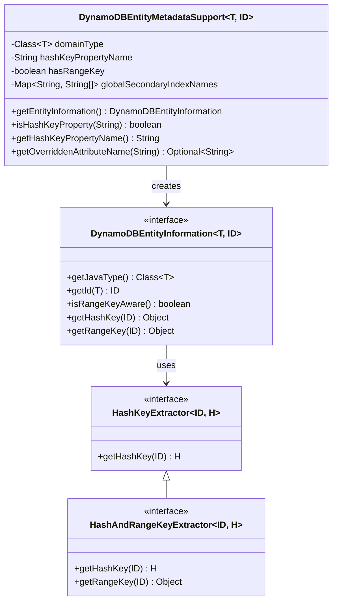
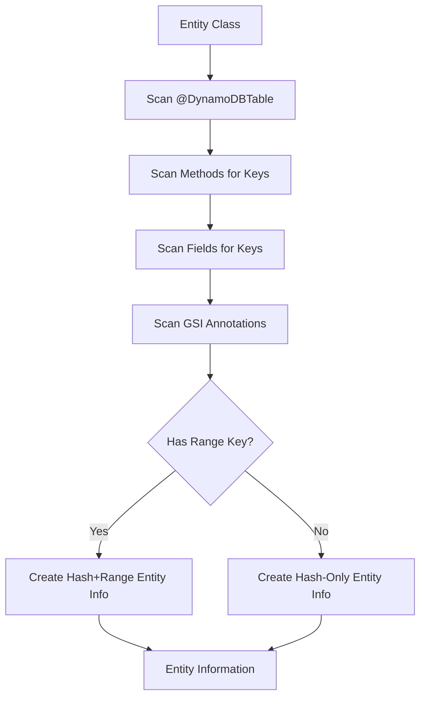
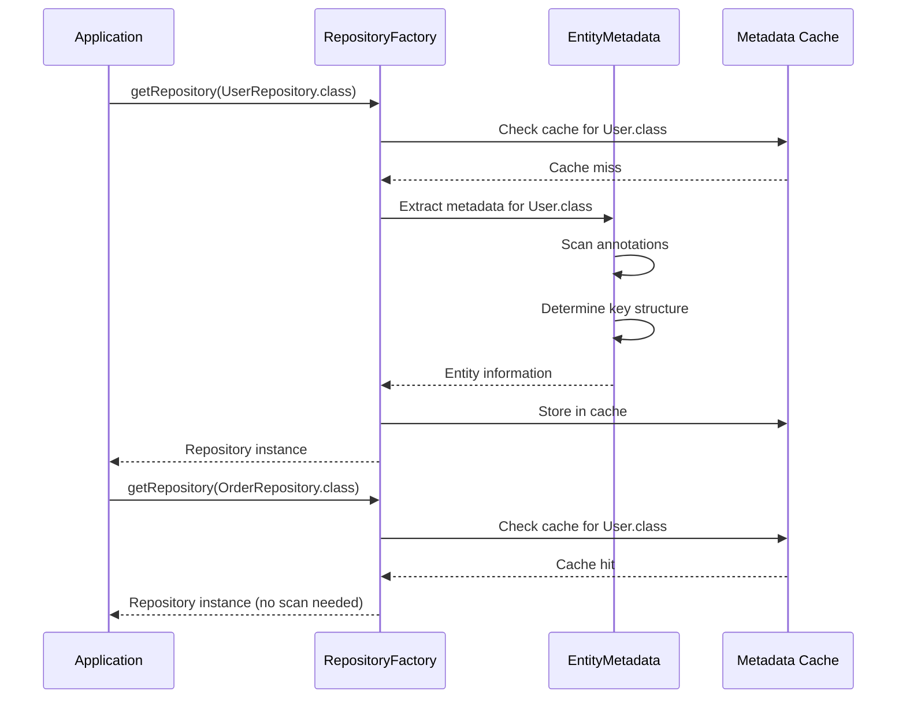

# Entity Mapping

Entity mapping provides the bridge between Java objects and DynamoDB tables, handling metadata extraction, key
management, and attribute conversion.

## Entity Mapping Architecture



## DynamoDBEntityMetadataSupport

The central class for extracting entity metadata through annotation scanning.

### Metadata Extraction Process



### Constructor and Initialization

```java
public class DynamoDBEntityMetadataSupport<T, ID>
        implements DynamoDBHashKeyExtractingEntityMetadata<T> {

    private final Class<T> domainType;
    private boolean hasRangeKey;
    private String hashKeyPropertyName;
    private final List<String> globalIndexHashKeyPropertyNames;
    private final List<String> globalIndexRangeKeyPropertyNames;
    private final String dynamoDBTableName;
    private Map<String, String[]> globalSecondaryIndexNames = new HashMap<>();

    public DynamoDBEntityMetadataSupport(final Class<T> domainType,
                                        DynamoDBOperations dynamoDBOperations) {
        Assert.notNull(domainType, "Domain type must not be null!");
        this.domainType = domainType;

        // Extract table name
        DynamoDBTable table = this.domainType.getAnnotation(DynamoDBTable.class);
        Assert.notNull(table, "Domain type must by annotated with DynamoDBTable!");

        if (dynamoDBOperations != null) {
            this.dynamoDBTableName =
                dynamoDBOperations.getOverriddenTableName(domainType, table.tableName());
        } else {
            this.dynamoDBTableName = table.tableName();
        }

        // Initialize collections
        this.hashKeyPropertyName = null;
        this.globalSecondaryIndexNames = new HashMap<>();
        this.globalIndexHashKeyPropertyNames = new ArrayList<>();
        this.globalIndexRangeKeyPropertyNames = new ArrayList<>();

        // Scan methods and fields for annotations
        scanMethodsForAnnotations();
        scanFieldsForAnnotations();

        Assert.notNull(hashKeyPropertyName,
            "Unable to find hash key field or getter method on " + domainType + "!");
    }
}
```

### Method Annotation Scanning

```java
private void scanMethodsForAnnotations() {
    ReflectionUtils.doWithMethods(domainType, method -> {
        // Scan for hash key
        if (method.getAnnotation(DynamoDBHashKey.class) != null) {
            hashKeyPropertyName = getPropertyNameForAccessorMethod(method);
        }

        // Scan for range key
        if (method.getAnnotation(DynamoDBRangeKey.class) != null) {
            hasRangeKey = true;
        }

        // Scan for GSI keys
        DynamoDBIndexRangeKey dynamoDBRangeKeyAnnotation =
            method.getAnnotation(DynamoDBIndexRangeKey.class);
        DynamoDBIndexHashKey dynamoDBHashKeyAnnotation =
            method.getAnnotation(DynamoDBIndexHashKey.class);

        if (dynamoDBRangeKeyAnnotation != null) {
            addGlobalSecondaryIndexNames(method, dynamoDBRangeKeyAnnotation);
        }
        if (dynamoDBHashKeyAnnotation != null) {
            addGlobalSecondaryIndexNames(method, dynamoDBHashKeyAnnotation);
        }
    });
}
```

### Field Annotation Scanning

```java
private void scanFieldsForAnnotations() {
    ReflectionUtils.doWithFields(domainType, field -> {
        // Scan for hash key
        if (field.getAnnotation(DynamoDBHashKey.class) != null) {
            hashKeyPropertyName = getPropertyNameForField(field);
        }

        // Scan for range key
        if (field.getAnnotation(DynamoDBRangeKey.class) != null) {
            hasRangeKey = true;
        }

        // Scan for GSI keys (similar to methods)
        DynamoDBIndexRangeKey dynamoDBRangeKeyAnnotation =
            field.getAnnotation(DynamoDBIndexRangeKey.class);
        DynamoDBIndexHashKey dynamoDBHashKeyAnnotation =
            field.getAnnotation(DynamoDBIndexHashKey.class);

        if (dynamoDBRangeKeyAnnotation != null) {
            addGlobalSecondaryIndexNames(field, dynamoDBRangeKeyAnnotation);
        }
        if (dynamoDBHashKeyAnnotation != null) {
            addGlobalSecondaryIndexNames(field, dynamoDBHashKeyAnnotation);
        }
    });
}
```

### Property Name Extraction

```java
protected String getPropertyNameForAccessorMethod(Method method) {
    String methodName = method.getName();
    String propertyName = null;

    if (methodName.startsWith("get")) {
        propertyName = methodName.substring(3);
    } else if (methodName.startsWith("is")) {
        propertyName = methodName.substring(2);
    }

    Assert.notNull(propertyName,
        "Hash or range key annotated accessor methods must start with 'get' or 'is'");

    // Convert first letter to lowercase
    String firstLetter = propertyName.substring(0, 1);
    String remainder = propertyName.substring(1);
    return firstLetter.toLowerCase() + remainder;
}

protected String getPropertyNameForField(Field field) {
    return field.getName();
}
```

**Supports Both:**

- **Method annotations**: `@DynamoDBHashKey public String getUserId() {...}`
- **Field annotations**: `@DynamoDBHashKey private String userId;`

### Attribute Name Overrides

```java
@Override
public Optional<String> getOverriddenAttributeName(final String propertyName) {
    Method method = findMethod(propertyName);
    if (method != null) {
        // Check various annotation types for attribute name override
        if (method.getAnnotation(DynamoDBAttribute.class) != null) {
            String attrName = method.getAnnotation(DynamoDBAttribute.class).attributeName();
            if (!StringUtils.isEmpty(attrName)) {
                return Optional.of(attrName);
            }
        }
        if (method.getAnnotation(DynamoDBHashKey.class) != null) {
            String attrName = method.getAnnotation(DynamoDBHashKey.class).attributeName();
            if (!StringUtils.isEmpty(attrName)) {
                return Optional.of(attrName);
            }
        }
        // Check other annotation types...
    }

    // Check field annotations if method not found
    Field field = findField(propertyName);
    if (field != null) {
        // Similar checks for field annotations...
    }

    return Optional.empty();
}
```

**Supports Custom Attribute Names:**

```java
@DynamoDBHashKey(attributeName = "pk")
public String getUserId() { return userId; }

@DynamoDBAttribute(attributeName = "user_email")
public String getEmail() { return email; }
```

### Type Converters and Marshallers

```java
@Override
public <V extends DynamoDBMarshaller<?>> V getMarshallerForProperty(final String propertyName) {
    DynamoDBMarshalling annotation = findAnnotation(propertyName, DynamoDBMarshalling.class);

    if (annotation != null) {
        try {
            @SuppressWarnings("unchecked")
            Class<V> marshallerClazz = (Class<V>) annotation.marshallerClass();
            return marshallerClazz.getDeclaredConstructor().newInstance();
        } catch (Exception e) {
            throw new RuntimeException("Failed to instantiate marshaller", e);
        }
    }
    return null;
}

@Override
public DynamoDBTypeConverter<?, ?> getTypeConverterForProperty(final String propertyName) {
    DynamoDBTypeConverted annotation = findAnnotation(propertyName, DynamoDBTypeConverted.class);

    if (annotation != null) {
        try {
            return annotation.converter().getDeclaredConstructor().newInstance();
        } catch (Exception e) {
            throw new RuntimeException("Failed to instantiate type converter", e);
        }
    }
    return null;
}
```

## DynamoDBEntityInformation

The interface that provides entity information to repositories.

### Interface Definition

```java
public interface DynamoDBEntityInformation<T, ID> {
    /**
     * Returns the domain class type.
     */
    Class<T> getJavaType();

    /**
     * Extracts the ID from the entity.
     */
    ID getId(T entity);

    /**
     * Returns whether this entity uses a range key.
     */
    boolean isRangeKeyAware();

    /**
     * Extracts the hash key from the ID.
     */
    Object getHashKey(ID id);

    /**
     * Extracts the range key from the ID (only if isRangeKeyAware()).
     */
    Object getRangeKey(ID id);
}
```

### Hash Key Only Implementation

```java
public class DynamoDBIdIsHashKeyEntityInformationImpl<T, ID>
        implements DynamoDBEntityInformation<T, ID> {

    private final Class<T> domainType;
    private final DynamoDBHashKeyExtractingEntityMetadata<T> metadata;

    public DynamoDBIdIsHashKeyEntityInformationImpl(
            Class<T> domainType,
            DynamoDBHashKeyExtractingEntityMetadata<T> metadata) {
        this.domainType = domainType;
        this.metadata = metadata;
    }

    @Override
    public boolean isRangeKeyAware() {
        return false;
    }

    @Override
    public Object getHashKey(ID id) {
        return id;  // ID IS the hash key
    }

    @Override
    public Object getRangeKey(ID id) {
        throw new UnsupportedOperationException("This entity does not have a range key");
    }

    @Override
    public ID getId(T entity) {
        // Extract ID from entity using reflection
        return getPropertyValue(entity, metadata.getHashKeyPropertyName());
    }
}
```

### Hash + Range Key Implementation

```java
public class DynamoDBIdIsHashAndRangeKeyEntityInformationImpl<T, ID>
        implements DynamoDBEntityInformation<T, ID> {

    private final Class<T> domainType;
    private final HashAndRangeKeyExtractor<ID, ?> keyExtractor;

    public DynamoDBIdIsHashAndRangeKeyEntityInformationImpl(
            Class<T> domainType,
            DynamoDBHashAndRangeKeyExtractingEntityMetadata<T, ID> metadata) {
        this.domainType = domainType;
        this.keyExtractor = createKeyExtractor(metadata);
    }

    @Override
    public boolean isRangeKeyAware() {
        return true;
    }

    @Override
    public Object getHashKey(ID id) {
        return keyExtractor.getHashKey(id);
    }

    @Override
    public Object getRangeKey(ID id) {
        return keyExtractor.getRangeKey(id);
    }

    @Override
    public ID getId(T entity) {
        Object hashKey = getPropertyValue(entity, metadata.getHashKeyPropertyName());
        Object rangeKey = getPropertyValue(entity, metadata.getRangeKeyPropertyName());
        return createCompositeId(hashKey, rangeKey);
    }
}
```

## Key Extractors

Key extractors handle the complexity of extracting hash and range keys from various ID types.

### HashKeyExtractor Interface

```java
public interface HashKeyExtractor<ID, H> {
    /**
     * Extracts the hash key from the ID.
     */
    H getHashKey(ID id);
}
```

### HashAndRangeKeyExtractor Interface

```java
public interface HashAndRangeKeyExtractor<ID, H> extends HashKeyExtractor<ID, H> {
    /**
     * Extracts the range key from the ID.
     */
    Object getRangeKey(ID id);
}
```

### ID is Hash Key Implementation

```java
public class HashKeyIsIdHashKeyExtractor<ID> implements HashKeyExtractor<ID, ID> {

    @Override
    public ID getHashKey(ID id) {
        return id;  // ID itself is the hash key
    }
}
```

**Usage:**

```java
@DynamoDBTable(tableName = "User")
public class User {
    @DynamoDBHashKey
    private String userId;  // ID type is String
}

// Repository
public interface UserRepository extends DynamoDBCrudRepository<User, String> {
    // ID String is directly the hash key
}
```

### Composite ID Implementation

```java
public class CompositeIdHashAndRangeKeyExtractor<ID>
        implements HashAndRangeKeyExtractor<ID, Object> {

    private final String hashKeyPropertyName;
    private final String rangeKeyPropertyName;

    public CompositeIdHashAndRangeKeyExtractor(
            String hashKeyPropertyName,
            String rangeKeyPropertyName) {
        this.hashKeyPropertyName = hashKeyPropertyName;
        this.rangeKeyPropertyName = rangeKeyPropertyName;
    }

    @Override
    public Object getHashKey(ID id) {
        return getPropertyValue(id, hashKeyPropertyName);
    }

    @Override
    public Object getRangeKey(ID id) {
        return getPropertyValue(id, rangeKeyPropertyName);
    }

    private Object getPropertyValue(ID id, String propertyName) {
        try {
            Field field = id.getClass().getDeclaredField(propertyName);
            field.setAccessible(true);
            return field.get(id);
        } catch (Exception e) {
            throw new RuntimeException("Failed to extract key from ID", e);
        }
    }
}
```

**Usage:**

```java
// Composite ID class
public class PlaylistItemId implements Serializable {
    private String playlistId;
    private String songId;

    public PlaylistItemId() {}

    public PlaylistItemId(String playlistId, String songId) {
        this.playlistId = playlistId;
        this.songId = songId;
    }

    // getters, setters, equals, hashCode
}

// Entity
@DynamoDBTable(tableName = "PlaylistItem")
public class PlaylistItem {
    @DynamoDBHashKey
    private String playlistId;

    @DynamoDBRangeKey
    private String songId;

    // other fields...
}

// Repository
public interface PlaylistItemRepository
        extends DynamoDBCrudRepository<PlaylistItem, PlaylistItemId> {
}
```

## Entity Annotation Examples

### Basic Hash Key Only Entity

```java
@DynamoDBTable(tableName = "User")
public class User {
    private String userId;
    private String username;
    private String email;

    @DynamoDBHashKey
    public String getUserId() {
        return userId;
    }

    public void setUserId(String userId) {
        this.userId = userId;
    }

    @DynamoDBAttribute
    public String getUsername() {
        return username;
    }

    public void setUsername(String username) {
        this.username = username;
    }

    @DynamoDBAttribute(attributeName = "user_email")
    public String getEmail() {
        return email;
    }

    public void setEmail(String email) {
        this.email = email;
    }
}
```

### Hash + Range Key Entity

```java
@DynamoDBTable(tableName = "Order")
public class Order {
    private String customerId;    // Hash key
    private String orderId;        // Range key
    private Date orderDate;
    private String status;

    @DynamoDBHashKey
    public String getCustomerId() {
        return customerId;
    }

    @DynamoDBRangeKey
    public String getOrderId() {
        return orderId;
    }

    @DynamoDBAttribute
    public Date getOrderDate() {
        return orderDate;
    }

    @DynamoDBIndexHashKey(globalSecondaryIndexName = "StatusIndex")
    public String getStatus() {
        return status;
    }

    // setters...
}
```

### Global Secondary Index (GSI)

```java
@DynamoDBTable(tableName = "User")
public class User {
    private String userId;
    private String email;
    private String status;

    @DynamoDBHashKey
    public String getUserId() {
        return userId;
    }

    @DynamoDBIndexHashKey(globalSecondaryIndexName = "EmailIndex")
    public String getEmail() {
        return email;
    }

    @DynamoDBIndexHashKey(globalSecondaryIndexName = "StatusIndex")
    @DynamoDBAttribute
    public String getStatus() {
        return status;
    }

    // setters...
}
```

**Repository Queries on GSI:**

```java
public interface UserRepository extends DynamoDBCrudRepository<User, String> {
    // Uses EmailIndex GSI
    User findByEmail(String email);

    // Uses StatusIndex GSI
    List<User> findByStatus(String status);
}
```

### Type Converters

```java
@DynamoDBTable(tableName = "Event")
public class Event {
    private String eventId;
    private ZonedDateTime eventTime;

    @DynamoDBHashKey
    public String getEventId() {
        return eventId;
    }

    @DynamoDBTypeConverted(converter = ZonedDateTimeConverter.class)
    public ZonedDateTime getEventTime() {
        return eventTime;
    }

    // setters...
}

// Custom converter
public class ZonedDateTimeConverter implements DynamoDBTypeConverter<String, ZonedDateTime> {

    @Override
    public String convert(ZonedDateTime time) {
        return time.toString();
    }

    @Override
    public ZonedDateTime unconvert(String stringValue) {
        return ZonedDateTime.parse(stringValue);
    }
}
```

### Auto-Generated Keys

```java
@DynamoDBTable(tableName = "User")
public class User {
    private String userId;

    @DynamoDBHashKey
    @DynamoDBAutoGeneratedKey
    public String getUserId() {
        return userId;
    }

    public void setUserId(String userId) {
        this.userId = userId;
    }
}
```

**Auto-generation happens on save:**

```java
User user = new User();
user.setUsername("john");
// userId is null

userRepository.save(user);
// userId now has generated UUID value
```

## Composite ID Best Practices

### ID Class Requirements

```java
public class CompositeId implements Serializable {
    private String hashKey;
    private String rangeKey;

    // 1. Default constructor (required)
    public CompositeId() {}

    // 2. Constructor with all keys
    public CompositeId(String hashKey, String rangeKey) {
        this.hashKey = hashKey;
        this.rangeKey = rangeKey;
    }

    // 3. Getters and setters
    public String getHashKey() { return hashKey; }
    public void setHashKey(String hashKey) { this.hashKey = hashKey; }
    public String getRangeKey() { return rangeKey; }
    public void setRangeKey(String rangeKey) { this.rangeKey = rangeKey; }

    // 4. equals() and hashCode() (critical!)
    @Override
    public boolean equals(Object o) {
        if (this == o) return true;
        if (o == null || getClass() != o.getClass()) return false;
        CompositeId that = (CompositeId) o;
        return Objects.equals(hashKey, that.hashKey) &&
               Objects.equals(rangeKey, that.rangeKey);
    }

    @Override
    public int hashCode() {
        return Objects.hash(hashKey, rangeKey);
    }

    // 5. toString() (helpful for debugging)
    @Override
    public String toString() {
        return "CompositeId{hashKey='" + hashKey + "', rangeKey='" + rangeKey + "'}";
    }
}
```

## Advanced Attribute Handling

### Ignored Attributes

```java
@DynamoDBTable(tableName = "User")
public class User {
    private String userId;
    private String temporaryData;

    @DynamoDBHashKey
    public String getUserId() {
        return userId;
    }

    @DynamoDBIgnore
    public String getTemporaryData() {
        return temporaryData;  // Not persisted to DynamoDB
    }
}
```

### Versioning for Optimistic Locking

```java
@DynamoDBTable(tableName = "User")
public class User {
    private String userId;
    private Long version;

    @DynamoDBHashKey
    public String getUserId() {
        return userId;
    }

    @DynamoDBVersionAttribute
    public Long getVersion() {
        return version;
    }

    public void setVersion(Long version) {
        this.version = version;
    }
}
```

**Automatic version management:**

```java
User user = new User();
user.setUsername("john");
userRepository.save(user);  // version = 1

user.setUsername("john_updated");
userRepository.save(user);  // version = 2

// Concurrent update will throw ConditionalCheckFailedException
```

## Metadata Caching

Entity metadata is extracted once per entity class and cached for performance.



## Performance Considerations

1. **Annotation scanning** happens once per entity class at initialization
2. **Reflection-based property access** can be slower than direct field access
3. **Type converters** add overhead to marshalling/unmarshalling
4. **GSI definitions** increase metadata extraction time
5. **Composite IDs** require additional property extraction

## Best Practices

1. **Use method annotations** for better encapsulation
2. **Implement proper equals/hashCode** for composite IDs
3. **Use type converters** for custom types (dates, enums, etc.)
4. **Define GSIs** for alternate query patterns
5. **Use @DynamoDBIgnore** for transient fields
6. **Enable versioning** for optimistic locking when needed
7. **Keep ID classes immutable** when possible
8. **Use meaningful attribute names** with attributeName override

## Next Steps

- [Design Patterns](design-patterns.html) - Explore architectural patterns
- [Query Execution](query-execution.html) - See how queries use entity metadata
- [Repository Layer](repository-layer.html) - Understand how repositories leverage entity information
