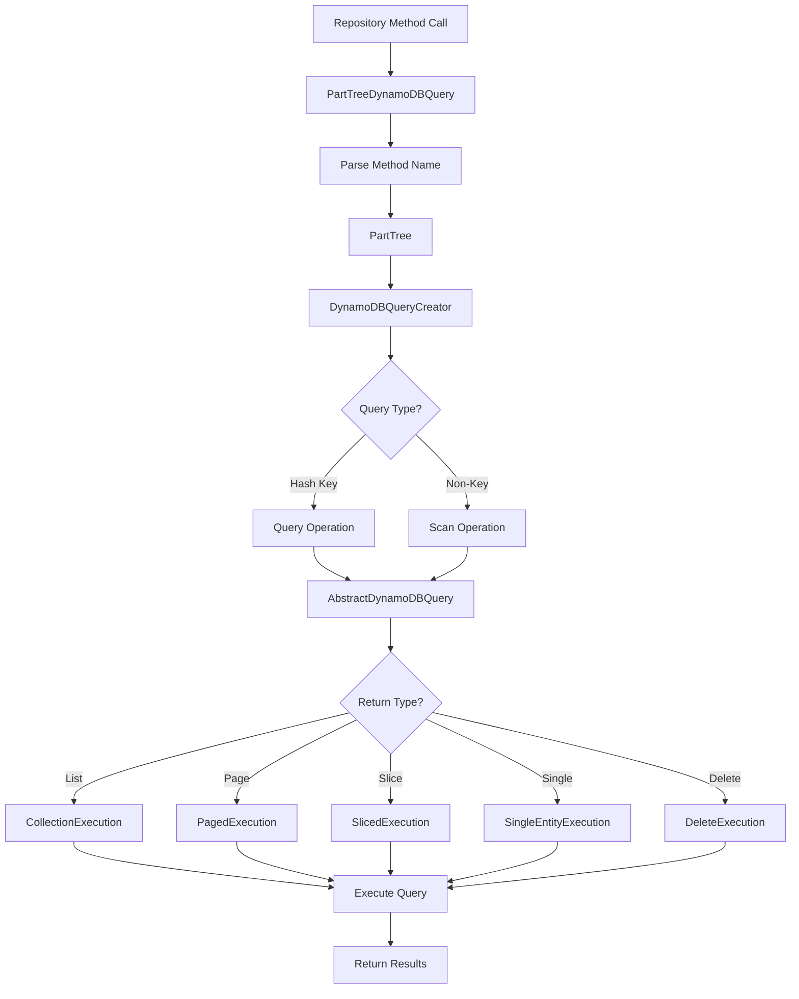
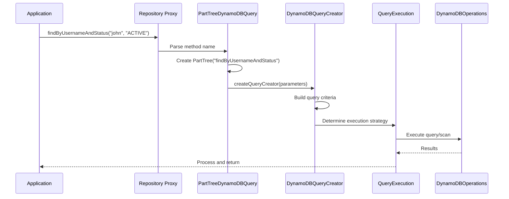
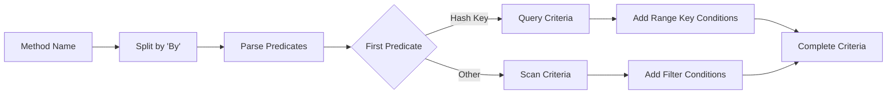
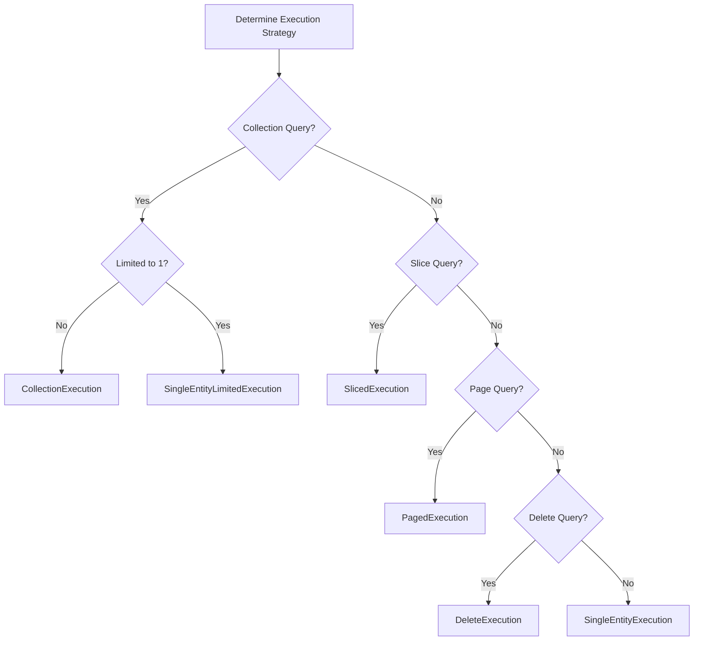

# Query Execution

The query execution layer is responsible for parsing repository method names and executing them as DynamoDB queries or
scans with the appropriate execution strategy.

## Query Execution Architecture



## Query Method Resolution

### Method Name Parsing Flow



## PartTreeDynamoDBQuery

The entry point for parsed query method execution.

### Class Structure

```java
public class PartTreeDynamoDBQuery<T, ID> extends AbstractDynamoDBQuery<T, ID>
        implements RepositoryQuery {

    private final Parameters<?, ?> parameters;
    private final PartTree tree;

    public PartTreeDynamoDBQuery(DynamoDBOperations dynamoDBOperations,
                                DynamoDBQueryMethod<T, ID> method) {
        super(dynamoDBOperations, method);
        this.parameters = method.getParameters();
        this.tree = new PartTree(method.getName(), method.getEntityType());
    }
}
```

### Query Creation

```java
protected DynamoDBQueryCreator<T, ID> createQueryCreator(
        ParametersParameterAccessor accessor) {
    DynamoDBQueryMethod<T, ID> queryMethod = getQueryMethod();
    return new DynamoDBQueryCreator<>(
        tree,
        accessor,
        queryMethod.getEntityInformation(),
        queryMethod.getProjectionExpression(),
        queryMethod.getLimitResults(),
        queryMethod.getConsistentReadMode(),
        queryMethod.getFilterExpression(),
        queryMethod.getExpressionAttributeNames(),
        queryMethod.getExpressionAttributeValues(),
        dynamoDBOperations
    );
}
```

**Query Creator Configuration:**

- **PartTree**: Parsed method name structure
- **ParameterAccessor**: Method parameters with type information
- **EntityInformation**: Entity metadata (keys, table name)
- **ProjectionExpression**: Optional field projection
- **LimitResults**: Result limit from @Limit annotation
- **ConsistentReadMode**: Strong vs eventual consistency
- **FilterExpression**: Additional filtering via @Query annotation
- **ExpressionAttributes**: Named/valued attributes for filter

### Query Execution Dispatch

```java
@Override
public Query<T> doCreateQuery(Object[] values) {
    ParametersParameterAccessor accessor = new ParametersParameterAccessor(parameters, values);
    DynamoDBQueryCreator<T, ID> queryCreator = createQueryCreator(accessor);
    return queryCreator.createQuery();
}

@Override
public Query<Long> doCreateCountQuery(Object[] values, boolean pageQuery) {
    ParametersParameterAccessor accessor = new ParametersParameterAccessor(parameters, values);
    DynamoDBCountQueryCreator<T, ID> queryCreator =
        createCountQueryCreator(accessor, pageQuery);
    return queryCreator.createQuery();
}
```

### Query Type Detection

```java
@Override
protected boolean isCountQuery() {
    return tree.isCountProjection();
}

@Override
protected boolean isExistsQuery() {
    return tree.isExistsProjection();
}

@Override
protected boolean isDeleteQuery() {
    return tree.isDelete();
}

@Override
protected Integer getResultsRestrictionIfApplicable() {
    if (tree.isLimiting()) {
        return tree.getMaxResults();
    }
    return null;
}
```

**Method Name Patterns:**

- `countByUsername` -> isCountQuery() = true
- `existsByEmail` -> isExistsQuery() = true
- `deleteByStatus` -> isDeleteQuery() = true
- `findTop10ByCategory` -> getResultsRestrictionIfApplicable() = 10

## DynamoDBQueryCreator

Translates parsed method parts into DynamoDB query expressions.

### Query Building Process

```java
public class DynamoDBQueryCreator<T, ID> extends AbstractDynamoDBQueryCreator<T, ID, T> {

    @Override
    protected Query<T> complete(@Nullable DynamoDBQueryCriteria<T, ID> criteria, Sort sort) {
        if (criteria == null) {
            return new StaticQuery<>(null);
        }

        criteria.withSort(sort);
        criteria.withProjection(projection);
        criteria.withLimit(limit);
        criteria.withConsistentReads(consistentReads);
        criteria.withFilterExpression(filterExpression);
        criteria.withExpressionAttributeNames(expressionAttributeNames);
        criteria.withExpressionAttributeValues(expressionAttributeValues);
        criteria.withMappedExpressionValues(mappedExpressionValues);

        return criteria.buildQuery(dynamoDBOperations);
    }
}
```

### Query Criteria Construction

The query creator builds criteria based on the method name parts:



### Supported Query Keywords

| Keyword      | DynamoDB Operation              | Example                          |
|--------------|---------------------------------|----------------------------------|
| And          | Multiple conditions             | findByUsernameAndStatus          |
| Or           | Multiple conditions (scan only) | findByEmailOrPhone               |
| Between      | Range key condition             | findByHashKeyAndRangeBetween     |
| LessThan     | Range key condition             | findByHashKeyAndScoreLessThan    |
| GreaterThan  | Range key condition             | findByHashKeyAndScoreGreaterThan |
| Like         | String contains (scan)          | findByNameLike                   |
| StartingWith | Begins with                     | findByHashKeyAndNameStartingWith |
| IsNull       | Attribute not exists            | findByOptionalFieldIsNull        |
| IsNotNull    | Attribute exists                | findByOptionalFieldIsNotNull     |
| In           | Multiple values                 | findByStatusIn                   |

### Hash Key Queries

```java
// Method name: findByUserId
// Generates: Query operation on hash key

public interface UserRepository extends DynamoDBCrudRepository<User, String> {
    List<User> findByUserId(String userId);
}

// Execution: DynamoDB Query with hashKey = userId
```

### Hash + Range Key Queries

```java
// Method name: findByPlaylistIdAndSongIdGreaterThan
// Generates: Query operation with range key condition

public interface PlaylistRepository extends DynamoDBCrudRepository<PlaylistItem, PlaylistItemId> {
    List<PlaylistItem> findByPlaylistIdAndSongIdGreaterThan(String playlistId, String songId);
}

// Execution: DynamoDB Query
//   hashKey = playlistId
//   rangeKey > songId
```

### Scan Operations

```java
// Method name: findByEmail (email is not a key)
// Generates: Scan operation with filter

@EnableScan
public interface UserRepository extends DynamoDBCrudRepository<User, String> {
    List<User> findByEmail(String email);
}

// Execution: DynamoDB Scan with filter expression
//   filterExpression: "email = :email"
```

## AbstractDynamoDBQuery

Provides execution strategy selection and implementation.

### Execution Strategy Selection

```java
protected QueryExecution<T, ID> getExecution() {
    if (method.isCollectionQuery() && !isSingleEntityResultsRestriction()) {
        return new CollectionExecution();
    } else if (method.isSliceQuery() && !isSingleEntityResultsRestriction()) {
        return new SlicedExecution(method.getParameters());
    } else if (method.isPageQuery() && !isSingleEntityResultsRestriction()) {
        return new PagedExecution(method.getParameters());
    } else if (method.isModifyingQuery()) {
        throw new UnsupportedOperationException("Modifying queries not yet supported");
    } else if (isSingleEntityResultsRestriction()) {
        return new SingleEntityLimitedExecution();
    } else if (isDeleteQuery()) {
        return new DeleteExecution();
    } else {
        return new SingleEntityExecution();
    }
}
```

**Strategy Decision Tree:**



## Execution Strategies

### CollectionExecution

Returns a List of entities.

```java
class CollectionExecution implements QueryExecution<T, ID> {

    @Override
    public Object execute(AbstractDynamoDBQuery<T, ID> dynamoDBQuery, Object[] values) {
        Query<T> query = dynamoDBQuery.doCreateQueryWithPermissions(values);
        if (getResultsRestrictionIfApplicable() != null) {
            return restrictMaxResultsIfNecessary(query.getResultList().iterator());
        } else {
            return query.getResultList();
        }
    }

    private List<T> restrictMaxResultsIfNecessary(Iterator<T> iterator) {
        int processed = 0;
        List<T> resultsPage = new ArrayList<>();
        while (iterator.hasNext() && processed < getResultsRestrictionIfApplicable()) {
            resultsPage.add(iterator.next());
            processed++;
        }
        return resultsPage;
    }
}
```

**Usage Examples:**

```java
List<User> findByStatus(String status);
List<User> findTop10ByCategory(String category);  // Limited to 10
```

### PagedExecution

Returns a Page with total count.

```java
class PagedExecution implements QueryExecution<T, ID> {

    private final Parameters<?, ?> parameters;

    @Override
    public Object execute(AbstractDynamoDBQuery<T, ID> dynamoDBQuery, Object[] values) {
        ParameterAccessor accessor = new ParametersParameterAccessor(parameters, values);
        Pageable pageable = accessor.getPageable();
        Query<T> query = dynamoDBQuery.doCreateQueryWithPermissions(values);

        List<T> results = query.getResultList();
        return createPage(results, pageable, dynamoDBQuery, values);
    }

    private Page<T> createPage(List<T> allResults, Pageable pageable,
                              AbstractDynamoDBQuery<T, ID> dynamoDBQuery, Object[] values) {
        Iterator<T> iterator = allResults.iterator();

        // Skip to requested page
        if (!pageable.isUnpaged() && pageable.getOffset() > 0) {
            long processedCount = scanThroughResults(iterator, pageable.getOffset());
            if (processedCount < pageable.getOffset()) {
                return new PageImpl<>(Collections.emptyList());
            }
        }

        // Count total results
        Query<Long> countQuery = dynamoDBQuery.doCreateCountQueryWithPermissions(values, true);
        long count = countQuery.getSingleResult();

        // Read page of results
        if (!pageable.isUnpaged()) {
            if (getResultsRestrictionIfApplicable() != null) {
                count = Math.min(count, getResultsRestrictionIfApplicable());
            }

            List<T> results =
                readPageOfResultsRestrictMaxResultsIfNecessary(iterator, pageable.getPageSize());
            return new PageImpl<>(results, pageable, count);
        } else {
            return new UnpagedPageImpl<>(allResults, count);
        }
    }
}
```

**Page Execution Flow:**

1. Fetch all matching results (lazy loaded)
2. Skip to requested page offset
3. Execute count query for total
4. Read page of results
5. Return Page object with results, pageable, and count

**Usage Examples:**

```java
Page<User> findByStatus(String status, Pageable pageable);
```

**Performance Consideration:**

- Count query executes separately
- Results are fetched lazily
- Only requested page is read into memory

### SlicedExecution

Returns a Slice without total count.

```java
class SlicedExecution implements QueryExecution<T, ID> {

    private final Parameters<?, ?> parameters;

    @Override
    public Object execute(AbstractDynamoDBQuery<T, ID> dynamoDBQuery, Object[] values) {
        ParameterAccessor accessor = new ParametersParameterAccessor(parameters, values);
        Pageable pageable = accessor.getPageable();
        Query<T> query = dynamoDBQuery.doCreateQueryWithPermissions(values);
        List<T> results = query.getResultList();
        return createSlice(results, pageable);
    }

    private Slice<T> createSlice(List<T> allResults, Pageable pageable) {
        Iterator<T> iterator = allResults.iterator();

        // Skip to requested page
        if (pageable.getOffset() > 0) {
            long processedCount = scanThroughResults(iterator, pageable.getOffset());
            if (processedCount < pageable.getOffset()) {
                return new SliceImpl<>(new ArrayList<>());
            }
        }

        // Read page of results
        List<T> results =
            readPageOfResultsRestrictMaxResultsIfNecessary(iterator, pageable.getPageSize());

        // Peek ahead to see if more results exist
        boolean hasMoreResults = scanThroughResults(iterator, 1) > 0;
        if (getResultsRestrictionIfApplicable() != null &&
            getResultsRestrictionIfApplicable() <= results.size()) {
            hasMoreResults = false;
        }

        return new SliceImpl<>(results, pageable, hasMoreResults);
    }
}
```

**Slice vs Page:**

- **Slice**: No count query, peek ahead for "has next"
- **Page**: Executes count query, knows total pages
- **Performance**: Slice is faster (no count operation)

**Usage Examples:**

```java
Slice<User> findByStatus(String status, Pageable pageable);
```

### SingleEntityExecution

Returns single entity or null/Optional.

```java
class SingleEntityExecution implements QueryExecution<T, ID> {

    @Override
    public Object execute(AbstractDynamoDBQuery<T, ID> dynamoDBQuery, Object[] values) {
        if (isCountQuery()) {
            return dynamoDBQuery.doCreateCountQueryWithPermissions(values, false).getSingleResult();
        } else if (isExistsQuery()) {
            return !dynamoDBQuery.doCreateQueryWithPermissions(values).getResultList().isEmpty();
        } else {
            return dynamoDBQuery.doCreateQueryWithPermissions(values).getSingleResult();
        }
    }
}
```

**Usage Examples:**

```java
User findByUsername(String username);
Optional<User> findByEmail(String email);
long countByStatus(String status);
boolean existsByEmail(String email);
```

### SingleEntityLimitedExecution

For methods like `findFirst` or `findTop1`.

```java
class SingleEntityLimitedExecution implements QueryExecution<T, ID> {

    @Override
    public Object execute(AbstractDynamoDBQuery<T, ID> dynamoDBQuery, Object[] values) {
        if (isCountQuery()) {
            return dynamoDBQuery.doCreateCountQueryWithPermissions(values, false).getSingleResult();
        } else {
            List<T> resultList = dynamoDBQuery.doCreateQueryWithPermissions(values).getResultList();
            return resultList.size() == 0 ? null : resultList.get(0);
        }
    }
}
```

**Usage Examples:**

```java
User findFirstByOrderByCreatedAtDesc();
User findTopByStatus(String status);
```

### DeleteExecution

Batch delete matching entities.

```java
class DeleteExecution implements QueryExecution<T, ID> {

    @Override
    public Object execute(AbstractDynamoDBQuery<T, ID> dynamoDBQuery, Object[] values)
            throws BatchDeleteException {
        List<T> entities = dynamoDBQuery.doCreateQueryWithPermissions(values).getResultList();
        List<DynamoDBMapper.FailedBatch> failedBatches =
            dynamoDBOperations.batchDelete(entities);

        if (failedBatches.isEmpty()) {
            return entities;
        } else {
            throw repackageToException(failedBatches, BatchDeleteException.class);
        }
    }
}
```

**Delete Execution Flow:**

1. Execute query to find matching entities
2. Batch delete all found entities
3. Return deleted entities on success
4. Throw BatchDeleteException on failure

**Usage Examples:**

```java
List<User> deleteByStatus(String status);
void deleteByCreatedAtBefore(Date date);
```

## Query vs Scan Decision

```mermaid
flowchart TD
    A[Method Name Parsed] --> B{First Condition on Hash Key?}
    B -->|Yes| C{Second Condition on Range Key or GSI?}
    B -->|No| D[SCAN Required]
    C -->|Range Key| E[QUERY on Table]
    C -->|GSI Hash/Range| F[QUERY on GSI]
    C -->|Other Attribute| G[QUERY + Filter]
    D --> H[@EnableScan Required]
    E --> I[Efficient Query]
    F --> I
    G --> J[Query with Post-Filter]

    style D fill:#ff6b6b
    style H fill:#ff6b6b
    style I fill:#51cf66
    style J fill:#ffd43b
```

### Query Examples

```java
// ✅ Efficient: Query on hash key
List<User> findByUserId(String userId);

// ✅ Efficient: Query with range key condition
List<Order> findByUserIdAndOrderDateBetween(String userId, Date start, Date end);

// ✅ Efficient: Query on GSI
List<User> findByEmail(String email);  // If email is GSI hash key

// ⚠️ Less Efficient: Query + filter expression
List<Order> findByUserIdAndStatus(String userId, String status);
// Query by userId, then filter by status
```

### Scan Examples

```java
// ❌ Scan Required: First condition not on key
@EnableScan
List<User> findByStatus(String status);

// ❌ Scan Required: OR condition
@EnableScan
List<User> findByEmailOrPhone(String email, String phone);

// ❌ Scan Required: LIKE on non-key attribute
@EnableScan
List<User> findByNameLike(String pattern);
```

## Performance Optimization

### Use Projections

```java
public interface UserRepository extends DynamoDBCrudRepository<User, String> {

    @Projection("userId, username, email")
    List<User> findByStatus(String status);
}
```

**Benefits:**

- Reduces data transfer
- Faster query response
- Lower consumed capacity

### Limit Results

```java
// Using method name
List<User> findTop100ByStatus(String status);

// Using annotation
@Limit(100)
List<User> findByStatus(String status);
```

### Consistent Reads

```java
@ConsistentRead
User findByUsername(String username);

// Default is eventually consistent (faster and cheaper)
```

### Use Slices for Pagination

```java
// ✅ Better: No count query
Slice<User> findByStatus(String status, Pageable pageable);

// ❌ Slower: Additional count query
Page<User> findByStatus(String status, Pageable pageable);
```

## Best Practices

1. **Design queries around hash keys** for efficient query operations
2. **Use GSIs** for alternate query patterns
3. **Avoid scans** in production unless absolutely necessary
4. **Use projections** to reduce data transfer
5. **Prefer Slice over Page** when total count not needed
6. **Limit results** for large queries
7. **Test query execution plans** before production deployment
8. **Monitor query costs** using DynamoDB metrics

## Common Patterns

### Load by ID Variants

```java
Optional<User> findById(String id);           // Single load
List<User> findAllById(Iterable<String> ids); // Batch load
```

### Existence Check

```java
boolean existsById(String id);
boolean existsByUsername(String username);
```

### Counting

```java
long count();                        // Table scan (requires @EnableScan)
long countByStatus(String status);   // Query or scan based on key
```

### Conditional Delete

```java
void deleteById(String id);
List<User> deleteByStatus(String status);  // Query then delete
```

## Next Steps

- [Entity Mapping](entity-mapping.html) - Understand entity metadata and annotations
- [Design Patterns](design-patterns.html) - Deep dive into architectural patterns
- [Core Components](core-components.html) - Review DynamoDBTemplate and operations
