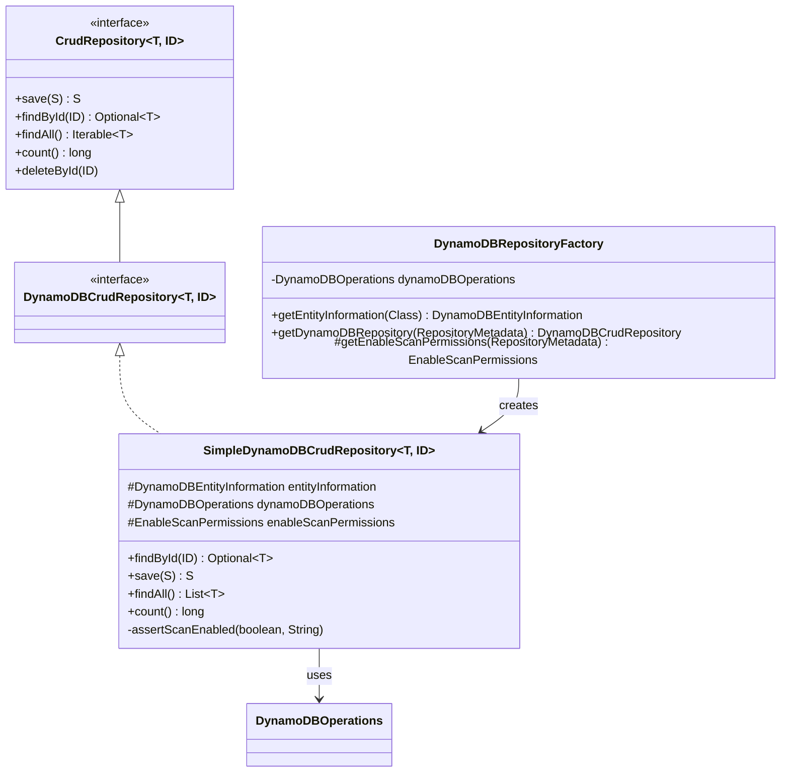
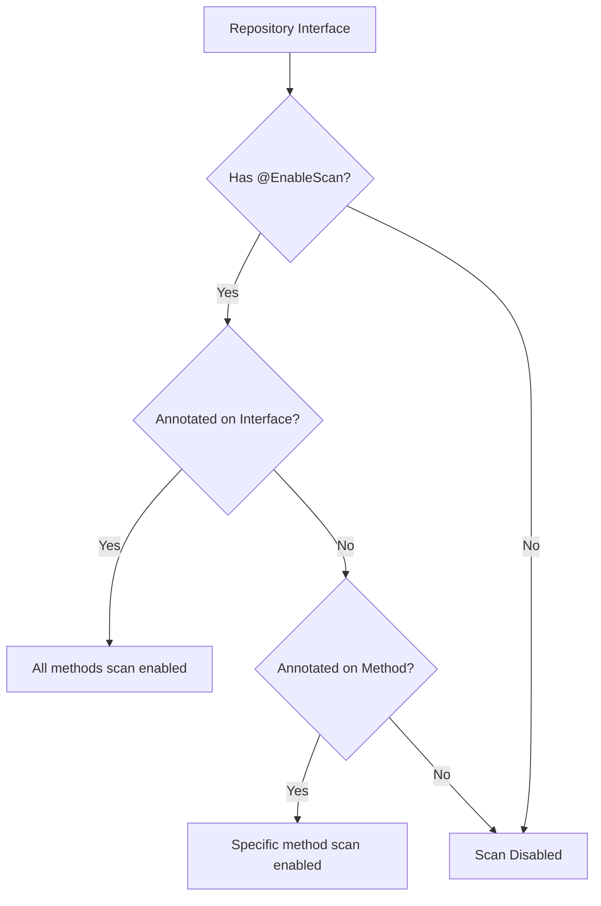
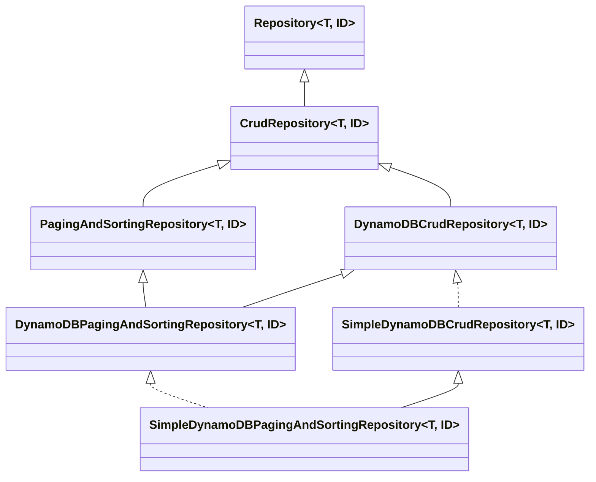

# Repository Layer

The repository layer provides the Spring Data programming model for DynamoDB, implementing CRUD operations and managing
repository lifecycle.

## Architecture Overview



## DynamoDBRepositoryFactory

The factory is responsible for creating repository instances with the correct configuration and entity information.

### Factory Responsibilities

1. **Version Compatibility Checking** - Validates Spring Data version compatibility
2. **Entity Information Extraction** - Creates metadata for entity types
3. **Repository Instance Creation** - Instantiates appropriate repository implementation
4. **Query Lookup Strategy** - Configures method name parsing strategy
5. **Scan Permissions Resolution** - Determines @EnableScan settings

### Factory Initialization

```java
public class DynamoDBRepositoryFactory extends RepositoryFactorySupport {
    private static final Logger LOGGER = LoggerFactory.getLogger(DynamoDBRepositoryFactory.class);

    static {
        String awsSdkVersion = VersionInfoUtils.getVersion();
        String springDataVersion = Version.class.getPackage().getImplementationVersion();
        String thisImplVersion = DynamoDBRepositoryFactory.class
            .getPackage().getImplementationVersion();

        LOGGER.info("Spring Data DynamoDB Version: {}", thisImplVersion);
        LOGGER.info("Spring Data Version:          {}", springDataVersion);
        LOGGER.info("AWS SDK Version:              {}", awsSdkVersion);

        if (!isCompatible(springDataVersion, thisImplVersion)) {
            LOGGER.warn("Version compatibility issue detected!");
        }
    }

    private final DynamoDBOperations dynamoDBOperations;

    public DynamoDBRepositoryFactory(DynamoDBOperations dynamoDBOperations) {
        this.dynamoDBOperations = dynamoDBOperations;
    }
}
```

**Design Decision: Static Version Logging**

- Logs version information once at class loading
- Helps diagnose compatibility issues
- Warns about potential version mismatches
- Provides debugging information in logs

### Entity Information Extraction

```java
@Override
public <T, ID> DynamoDBEntityInformation<T, ID> getEntityInformation(final Class<T> domainClass) {
    final DynamoDBEntityMetadataSupport<T, ID> metadata =
        new DynamoDBEntityMetadataSupport<>(domainClass, this.dynamoDBOperations);
    return metadata.getEntityInformation();
}
```

**Entity Information Determines:**

- Whether entity uses hash key only or hash+range key
- Primary key property names
- Global/Local secondary index definitions
- Table name and overrides

### Repository Creation

```java
@SuppressWarnings({"unchecked", "rawtypes"})
protected <T, ID> DynamoDBCrudRepository<?, ?> getDynamoDBRepository(
        RepositoryMetadata metadata) {
    return new SimpleDynamoDBPagingAndSortingRepository(
        getEntityInformation(metadata.getDomainType()),
        dynamoDBOperations,
        getEnableScanPermissions(metadata)
    );
}

@Override
protected Object getTargetRepository(RepositoryInformation metadata) {
    return getDynamoDBRepository(metadata);
}

@Override
protected Class<?> getRepositoryBaseClass(RepositoryMetadata metadata) {
    if (isQueryDslRepository(metadata.getRepositoryInterface())) {
        throw new IllegalArgumentException("QueryDsl Support has not been implemented yet.");
    }
    return SimpleDynamoDBPagingAndSortingRepository.class;
}
```

**Repository Creation Flow:**

1. Extract entity metadata from domain class
2. Determine if QueryDsl support is needed (throws exception)
3. Check for @EnableScan annotations on repository interface
4. Create SimpleDynamoDBPagingAndSortingRepository instance
5. Inject entity information, operations, and scan permissions

### Query Lookup Strategy

```java
@Override
protected Optional<QueryLookupStrategy> getQueryLookupStrategy(
        Key key,
        QueryMethodEvaluationContextProvider evaluationContextProvider) {
    return Optional.of(DynamoDBQueryLookupStrategy.create(dynamoDBOperations, key));
}
```

**Strategy Determines:**

- How method names are parsed into queries
- Which query creator to use
- When to use @Query annotations (future feature)

## SimpleDynamoDBCrudRepository

The base implementation of CRUD operations for DynamoDB repositories.

### Repository Structure

```java
public class SimpleDynamoDBCrudRepository<T, ID>
    implements DynamoDBCrudRepository<T, ID>, SortHandler, ExceptionHandler {

    protected DynamoDBEntityInformation<T, ID> entityInformation;
    protected Class<T> domainType;
    protected EnableScanPermissions enableScanPermissions;
    protected DynamoDBOperations dynamoDBOperations;

    public SimpleDynamoDBCrudRepository(
            DynamoDBEntityInformation<T, ID> entityInformation,
            DynamoDBOperations dynamoDBOperations,
            EnableScanPermissions enableScanPermissions) {
        Assert.notNull(entityInformation, "entityInformation must not be null");
        Assert.notNull(dynamoDBOperations, "dynamoDBOperations must not be null");

        this.entityInformation = entityInformation;
        this.dynamoDBOperations = dynamoDBOperations;
        this.domainType = entityInformation.getJavaType();
        this.enableScanPermissions = enableScanPermissions;
    }
}
```

### Read Operations

#### findById - Handles Hash and Range Keys

```java
@Override
public Optional<T> findById(ID id) {
    Assert.notNull(id, "The given id must not be null!");

    T result;
    if (entityInformation.isRangeKeyAware()) {
        // Hash + Range key entity
        result = dynamoDBOperations.load(
            domainType,
            entityInformation.getHashKey(id),
            entityInformation.getRangeKey(id)
        );
    } else {
        // Hash key only entity
        result = dynamoDBOperations.load(domainType, entityInformation.getHashKey(id));
    }

    return Optional.ofNullable(result);
}
```

**Key Extraction Logic:**

- **Hash Key Only**: ID is the hash key directly
- **Hash + Range Key**: ID is a composite containing both keys
- **Composite ID Class**: Uses @DynamoDBHashAndRangeKey annotation

#### findAllById - Batch Load Operation

```java
@Override
public List<T> findAllById(Iterable<ID> ids) {
    Assert.notNull(ids, "The given ids must not be null!");

    // Convert IDs to KeyPair objects
    AtomicInteger idx = new AtomicInteger();
    List<KeyPair> keyPairs = StreamSupport.stream(ids.spliterator(), false)
        .map(id -> {
            Assert.notNull(id,
                "The given id at position " + idx.getAndIncrement() + " must not be null!");

            if (entityInformation.isRangeKeyAware()) {
                return new KeyPair()
                    .withHashKey(entityInformation.getHashKey(id))
                    .withRangeKey(entityInformation.getRangeKey(id));
            } else {
                return new KeyPair().withHashKey(id);
            }
        })
        .toList();

    Map<Class<?>, List<KeyPair>> keyPairsMap = Collections.singletonMap(domainType, keyPairs);
    return dynamoDBOperations.batchLoad(keyPairsMap);
}
```

**Batch Load Characteristics:**

- Validates each ID is non-null with position information
- Handles both simple and composite keys
- Uses AWS batchGetItem under the hood
- Up to 100 items per batch (AWS limit)
- Efficient for retrieving multiple items

### Write Operations

#### save - Single Item Save

```java
@Override
public <S extends T> S save(S entity) {
    dynamoDBOperations.save(entity);
    return entity;
}
```

**Simple but Powerful:**

- Delegates to DynamoDBTemplate
- Triggers BeforeSave/AfterSave events
- Returns same entity instance
- Type parameter S allows subtypes

#### saveAll - Batch Write Operation

```java
@Override
public <S extends T> Iterable<S> saveAll(Iterable<S> entities)
        throws BatchWriteException, IllegalArgumentException {

    Assert.notNull(entities, "The given Iterable of entities not be null!");
    List<FailedBatch> failedBatches = dynamoDBOperations.batchSave(entities);

    if (failedBatches.isEmpty()) {
        // Happy path
        return entities;
    } else {
        // Error handling: repackage failures into exception
        throw repackageToException(failedBatches, BatchWriteException.class);
    }
}
```

**Error Handling Strategy:**

- Returns entities on success
- Throws BatchWriteException on any failures
- Exception contains detailed failure information
- Allows caller to retry failed items

### Delete Operations

#### deleteById - Single Item Delete with Validation

```java
@Override
public void deleteById(ID id) {
    Assert.notNull(id, "The given id must not be null!");

    Optional<T> entity = findById(id);

    if (entity.isPresent()) {
        dynamoDBOperations.delete(entity.get());
    } else {
        throw new EmptyResultDataAccessException(
            String.format("No %s entity with id %s exists!", domainType, id), 1
        );
    }
}
```

**Design Decision: Load Before Delete**

- Ensures entity exists before deleting
- Provides better error messages
- Allows BeforeDelete event with full entity
- Trade-off: Extra read operation

#### deleteAll(Iterable) - Batch Delete

```java
@Override
public void deleteAll(Iterable<? extends T> entities) {
    Assert.notNull(entities, "The given Iterable of entities not be null!");
    dynamoDBOperations.batchDelete(entities);
}
```

### Scan Protection

A critical safety feature preventing expensive accidental table scans.

#### Scan Protection Mechanism

```java
void assertScanEnabled(boolean scanEnabled, String methodName) {
    Assert.isTrue(scanEnabled,
        "Scanning for unpaginated " + methodName + "() queries is not enabled. " +
        "To enable, re-implement the " + methodName + "() method in your repository " +
        "interface and annotate with @EnableScan, or enable scanning for all " +
        "repository methods by annotating your repository interface with @EnableScan"
    );
}

@Override
public List<T> findAll() {
    assertScanEnabled(enableScanPermissions.isFindAllUnpaginatedScanEnabled(), "findAll");
    DynamoDBScanExpression scanExpression = new DynamoDBScanExpression();
    return dynamoDBOperations.scan(domainType, scanExpression);
}

@Override
public long count() {
    assertScanEnabled(enableScanPermissions.isCountUnpaginatedScanEnabled(), "count");
    final DynamoDBScanExpression scanExpression = new DynamoDBScanExpression();
    return dynamoDBOperations.count(domainType, scanExpression);
}

@Override
public void deleteAll() {
    assertScanEnabled(enableScanPermissions.isDeleteAllUnpaginatedScanEnabled(), "deleteAll");
    dynamoDBOperations.batchDelete(findAll());
}
```

**Protected Operations:**

- `findAll()` - Scans entire table
- `count()` - Scans entire table for count
- `deleteAll()` - Scans entire table then batch deletes

**Why Scan Protection?**

- Prevents accidental expensive operations
- Forces explicit acknowledgment of scan operations
- Protects production systems from performance issues
- Makes developers aware of operation cost

## EnableScanPermissions

### Permission Resolution Strategy



### EnableScanAnnotationPermissions Implementation

```java
public class EnableScanAnnotationPermissions implements EnableScanPermissions {
    private final boolean findAllUnpaginatedScanEnabled;
    private final boolean deleteAllUnpaginatedScanEnabled;
    private final boolean countUnpaginatedScanEnabled;

    public EnableScanAnnotationPermissions(Class<?> repositoryInterface) {
        EnableScan classScanAnnotation = repositoryInterface.getAnnotation(EnableScan.class);

        // Check if interface-level @EnableScan exists
        boolean classScanEnabled = classScanAnnotation != null;

        // Check method-level @EnableScan for each operation
        this.findAllUnpaginatedScanEnabled = classScanEnabled ||
            hasMethodAnnotation(repositoryInterface, "findAll");
        this.deleteAllUnpaginatedScanEnabled = classScanEnabled ||
            hasMethodAnnotation(repositoryInterface, "deleteAll");
        this.countUnpaginatedScanEnabled = classScanEnabled ||
            hasMethodAnnotation(repositoryInterface, "count");
    }

    private boolean hasMethodAnnotation(Class<?> repositoryInterface, String methodName) {
        try {
            Method method = repositoryInterface.getMethod(methodName);
            return method.getAnnotation(EnableScan.class) != null;
        } catch (NoSuchMethodException e) {
            return false;
        }
    }
}
```

### Usage Examples

#### Repository-Level Scan Enabling

```java
@EnableScan
public interface UserRepository extends DynamoDBCrudRepository<User, String> {
    // All scan operations enabled for this repository
}
```

#### Method-Level Scan Enabling

```java
public interface UserRepository extends DynamoDBCrudRepository<User, String> {

    @EnableScan
    List<User> findAll();  // Only findAll() scan enabled

    // count() and deleteAll() will throw exception
}
```

#### Scan Disabled (Default)

```java
public interface UserRepository extends DynamoDBCrudRepository<User, String> {
    // findAll(), count(), deleteAll() will throw exception
    // Must use query methods with hash key
}
```

## Entity Information

### DynamoDBEntityInformation Interface

```java
public interface DynamoDBEntityInformation<T, ID> {
    Class<T> getJavaType();
    ID getId(T entity);
    boolean isRangeKeyAware();
    Object getHashKey(ID id);
    Object getRangeKey(ID id);  // Only if isRangeKeyAware()
}
```

### Hash Key Only Entity

```java
@DynamoDBTable(tableName = "User")
public class User {
    private String userId;
    private String name;

    @DynamoDBHashKey
    public String getUserId() {
        return userId;
    }

    // ... setters and other fields
}

// Repository
public interface UserRepository extends DynamoDBCrudRepository<User, String> {
    // ID type is String (same as hash key)
}
```

**Entity Information Implementation:**

```java
public class DynamoDBIdIsHashKeyEntityInformationImpl<T, ID>
        implements DynamoDBEntityInformation<T, ID> {

    @Override
    public boolean isRangeKeyAware() {
        return false;
    }

    @Override
    public Object getHashKey(ID id) {
        return id;  // ID IS the hash key
    }

    @Override
    public Object getRangeKey(ID id) {
        throw new UnsupportedOperationException("Entity has no range key");
    }
}
```

### Hash + Range Key Entity

```java
@DynamoDBTable(tableName = "PlaylistItem")
public class PlaylistItem {
    private String playlistId;
    private String songId;
    private String songName;

    @DynamoDBHashKey
    public String getPlaylistId() {
        return playlistId;
    }

    @DynamoDBRangeKey
    public String getSongId() {
        return songId;
    }

    // ... setters and other fields
}

// Composite ID class
public class PlaylistItemId implements Serializable {
    private String playlistId;
    private String songId;

    // constructors, getters, setters, equals, hashCode
}

// Repository
public interface PlaylistItemRepository
        extends DynamoDBCrudRepository<PlaylistItem, PlaylistItemId> {
    // ID type is composite class
}
```

**Entity Information Implementation:**

```java
public class DynamoDBIdIsHashAndRangeKeyEntityInformationImpl<T, ID>
        implements DynamoDBEntityInformation<T, ID> {

    private final HashAndRangeKeyExtractor<ID, ?> keyExtractor;

    @Override
    public boolean isRangeKeyAware() {
        return true;
    }

    @Override
    public Object getHashKey(ID id) {
        return keyExtractor.getHashKey(id);
    }

    @Override
    public Object getRangeKey(ID id) {
        return keyExtractor.getRangeKey(id);
    }
}
```

## Exception Handling

### ExceptionHandler Interface

```java
public interface ExceptionHandler {
    default <E extends DynamoDBBatchException> E repackageToException(
            List<FailedBatch> failedBatches,
            Class<E> exceptionClass) {
        try {
            return exceptionClass
                .getConstructor(List.class)
                .newInstance(failedBatches);
        } catch (Exception e) {
            throw new RuntimeException("Failed to create exception", e);
        }
    }
}
```

### Batch Exception Details

```java
public class BatchWriteException extends DynamoDBBatchException {
    public BatchWriteException(List<FailedBatch> failedBatches) {
        super("Batch write failed", failedBatches);
    }

    public List<Object> getFailedItems() {
        return getFailedBatches().stream()
            .flatMap(batch -> batch.getUnprocessedItems().values().stream())
            .flatMap(List::stream)
            .map(WriteRequest::getPutRequest)
            .map(PutRequest::getItem)
            .collect(Collectors.toList());
    }
}
```

**Exception Provides:**

- List of failed batches with details
- Unprocessed items for retry
- Exception type (write vs delete)
- Original error messages

## Repository Hierarchy



## Best Practices

1. **Always use specific repository interfaces** rather than CrudRepository
2. **Enable scans only when necessary** and understand the performance implications
3. **Use composite ID classes** for hash+range key entities with proper equals/hashCode
4. **Handle BatchWriteException** in production code with retry logic
5. **Use findAllById** for batch operations instead of multiple findById calls
6. **Override repository methods** to add custom @EnableScan annotations per method

## Next Steps

- [Query Execution](query-execution.html) - Learn how query methods are parsed and executed
- [Entity Mapping](entity-mapping.html) - Understand entity metadata and key extraction
- [Design Patterns](design-patterns.html) - Explore architectural patterns in depth
